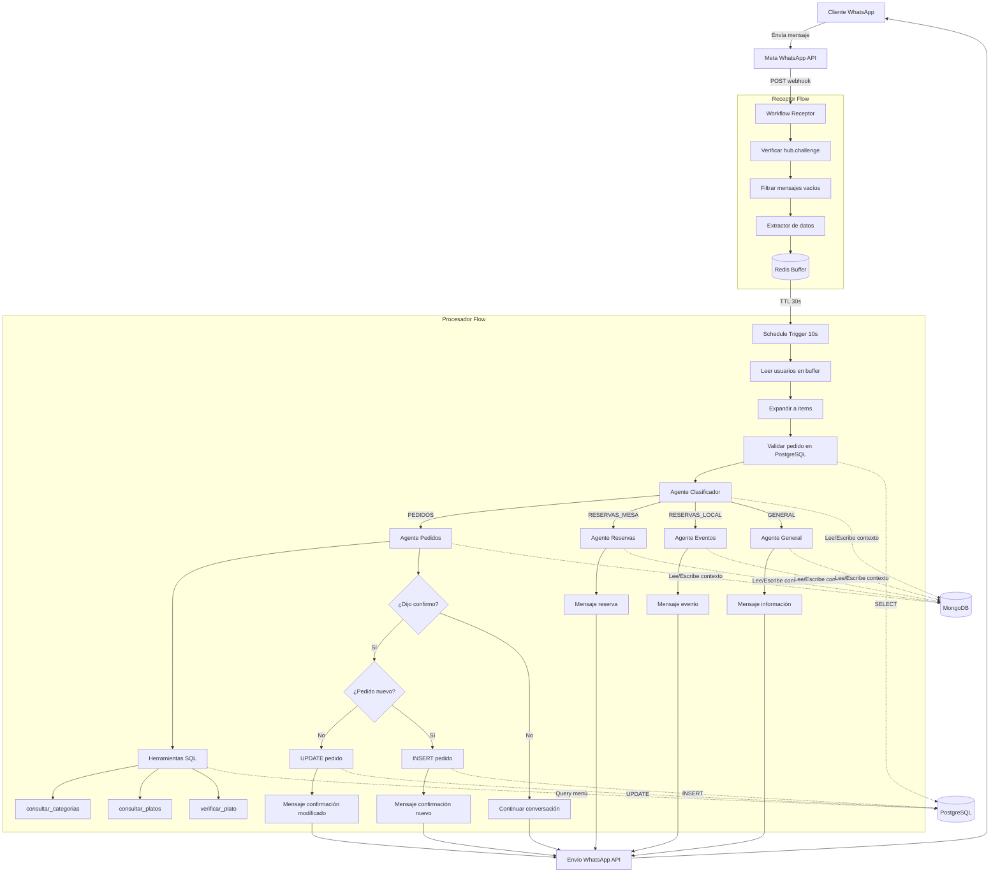
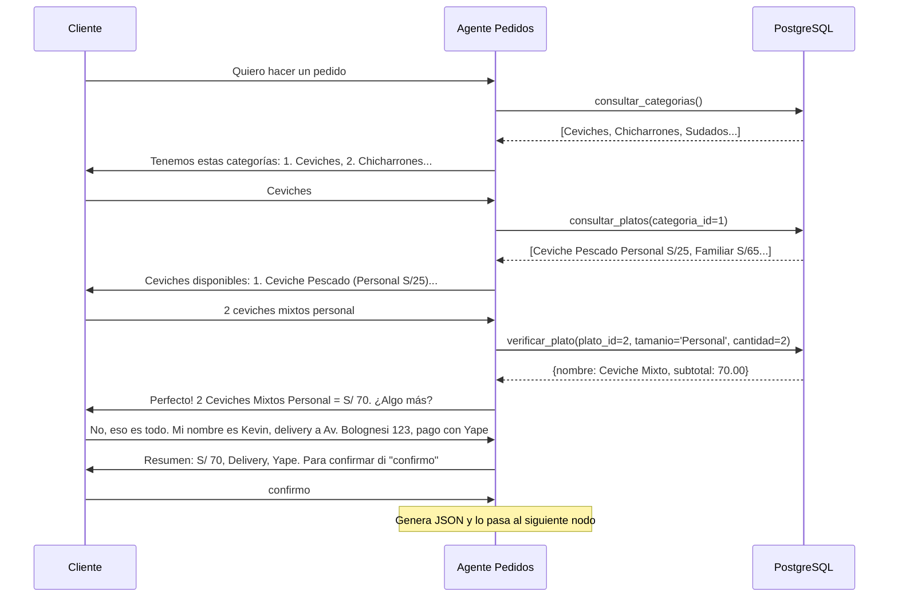

## Visión General

Automatización Lurwis está construida con una arquitectura de **microservicios asíncronos** orquestados por n8n. El sistema separa la recepción de mensajes (Receptor) del procesamiento inteligente (Procesador) para maximizar la confiabilidad y escalabilidad.

## Diagrama de Arquitectura Completo



## Componentes Principales

### 1. Workflow Receptor

**Propósito**: Punto de entrada ultrarrápido que recibe webhooks de Meta y los almacena temporalmente.

<Card title="Características Clave" icon="bolt">
  - Responde en < 100ms para evitar timeouts de Meta
  - Filtra eventos innecesarios (status updates, read receipts)
  - Agrupa mensajes rápidos del mismo usuario en un solo contexto
  - No contiene lógica de negocio (solo enrutamiento)
</Card>

#### Flujo Interno del Receptor

<Steps>
  <Step title="Webhook Trigger">
    El nodo Webhook escucha en `POST /meta-verify` con dos tipos de peticiones:
    
    **GET (Verificación)**: Meta valida el webhook enviando `hub.mode`, `hub.verify_token` y `hub.challenge`. El sistema verifica el token y devuelve el challenge.
    
    **POST (Mensaje)**: Meta envía el payload completo del mensaje con estructura:
    ```json
    {
      "object": "whatsapp_business_account",
      "entry": [{
        "changes": [{
          "value": {
            "messages": [{
              "from": "51900769907",
              "text": { "body": "Hola" },
              "id": "wamid.xxx"
            }],
            "contacts": [{
              "profile": { "name": "Kevin" }
            }]
          }
        }]
      }]
    }
    ```
  </Step>
  
  <Step title="Filtrado de Mensajes Vacíos">
    Nodo IF llamado **"Identificador de vacíos"** valida:
    
    ```javascript
    messages[0] NOT EMPTY AND
    messages[0].text.body NOT EMPTY AND
    statuses IS EMPTY
    ```
    
    Esto descarta confirmaciones de entrega y estados leídos que Meta envía continuamente.
  </Step>
  
  <Step title="Extracción de Datos">
    Nodo Set llamado **"Extractormensajes"** limpia el payload complejo y extrae solo:
    
    - `from`: Número de teléfono (ej: `51900769907`)
    - `text.body`: Contenido del mensaje
    - `id cliente`: ID único del mensaje de WhatsApp
    - `id mensajero`: Phone Number ID de Meta (para responder)
    - `profile_name`: Nombre del contacto en WhatsApp
  </Step>
  
  <Step title="Sistema de Buffer en Redis">
    Secuencia de 4 nodos Redis para agregar mensajes:
    
    1. **Buffer: Buscar** - Busca si existe `buffer_{telefono}` en Redis
    2. **Buffer: Agregar Mensaje** - Código JS que concatena:
       ```javascript
       updatedBuffer = existingBuffer
         ? `${existingBuffer}\n${newMessage}`
         : newMessage
       ```
    3. **Buffer: Guardar** - Guarda el texto agregado con TTL 30s
    4. **Buffer: Timestamp** - Actualiza `ts_{telefono}` con timestamp actual
    5. **Buffer: Meta** - Guarda `meta_{telefono}` con el ID del mensajero (TTL 120s)
    
    <Info>
      Si el cliente envía "Hola", "Quiero", "Un ceviche" en 5 segundos, Redis agrupa todo como "Hola\nQuiero\nUn ceviche" para que el Procesador lo vea como un solo contexto.
    </Info>
  </Step>
  
  <Step title="Respuesta Inmediata">
    Nodo **"Respond to Webhook2"** devuelve HTTP 200 OK a Meta:
    ```
    Status: 200
    Body: OK
    Headers: Content-Type: text/plain
    ```
    
    Esto confirma a Meta que el mensaje fue recibido, evitando reintentos.
  </Step>
</Steps>

<Warning>
  El Receptor NO envía ningún mensaje al cliente. Solo recibe y almacena. La respuesta la genera el Procesador después.
</Warning>

### 2. Workflow Procesador

**Propósito**: Motor de inteligencia que consume el buffer, clasifica intenciones y ejecuta lógica de negocio con agentes especializados.

<Card title="Características Clave" icon="brain">
  - Se ejecuta cada 10 segundos automáticamente (Schedule Trigger)
  - Procesa múltiples usuarios en paralelo
  - Usa Google Gemini para clasificación e interacción
  - Mantiene memoria conversacional en MongoDB
  - Escribe pedidos confirmados en PostgreSQL
</Card>

#### Flujo Interno del Procesador

<Steps>
  <Step title="Schedule Trigger">
    Cada 10 segundos, el workflow se ejecuta automáticamente. Esto es **polling asíncrono** - desacopla la recepción (Receptor) del procesamiento.
  </Step>
  
  <Step title="Buscar Usuarios Activos">
    Nodo **"Redis: Buscar usuarios activos"** ejecuta:
    ```redis
    KEYS ts_*
    ```
    
    Esto devuelve todas las keys de timestamp, ej:
    ```json
    {
      "ts_51900769907": "1771550707733",
      "ts_51912345678": "1771550701234"
    }
    ```
  </Step>
  
  <Step title="Expandir a Items Individuales">
    Nodo **"Code: Expandir usuarios"** convierte el objeto en array de items:
    ```javascript
    return keys.map(key => ({
      json: {
        tsKey: key,
        userId: key.replace('ts_', ''),
        bufferKey: key.replace('ts_', 'buffer_'),
        metaKey: key.replace('ts_', 'meta_')
      }
    }));
    ```
    
    n8n procesa cada item en paralelo, permitiendo atender múltiples clientes simultáneamente.
  </Step>
  
  <Step title="Validar Timeout del Buffer">
    Nodo **"If"** verifica si pasaron más de 8 segundos desde el último mensaje:
    ```javascript
    Date.now() - Number($json.value) > 8000
    ```
    
    Si es `true`, el cliente dejó de escribir → procesar ahora. Si es `false`, esperar 10 segundos más (siguiente ciclo).
  </Step>
  
  <Step title="Leer y Eliminar Buffer">
    Secuencia de nodos que:
    
    1. Lee `buffer_{userId}` (mensajes concatenados)
    2. Lee `meta_{userId}` (ID del mensajero)
    3. Elimina ambas keys de Redis
    4. Elimina `ts_{userId}`
    
    Esto limpia Redis automáticamente y libera memoria.
  </Step>
  
  <Step title="Recrear Estructura Extractormensajes">
    Nodo **"Extractormensajes"** (sí, mismo nombre que en Receptor) formatea:
    ```javascript
    return {
      json: {
        from: userData.userId,
        'text.body': mensajesUnidos,
        text: { body: mensajesUnidos },
        'id mensajero': idMensajero,
        'id cliente': `buf_${Date.now()}`,
        profile_name: 'Cliente',
        buffered: true
      }
    };
    ```
  </Step>
  
  <Step title="Validar Pedido Existente">
    Nodo PostgreSQL **"Validar si tiene pedido o no"** ejecuta:
    ```sql
    SELECT id, detalle_pedido, total_final, estado_pedido 
    FROM pedidos_picanteria 
    WHERE TRIM(telefono) = TRIM('{{ from }}')
    AND estado_pedido NOT IN ('entregado', 'cancelado')
    LIMIT 1
    ```
    
    Si devuelve un registro, el cliente tiene un pedido pendiente.
  </Step>
  
  <Step title="Bifurcación: ¿Tiene Pedido?">
    Nodo IF **"¿Tiene Pedido Pendiente?"** decide:
    
    **SI tiene pedido pendiente** → Activar **"Detector de pedidos"** (agente que pregunta si quiere modificar o solo consultar)
    
    **NO tiene pedido** → Ir directo al **"Agente Clasificador"**
  </Step>
  
  <Step title="Clasificación de Intención">
    **Agente Clasificador** (Google Gemini Flash) analiza el mensaje con este prompt:
    
    ```
    Eres un clasificador experto de intenciones para un restaurante.
    
    Si el usuario menciona "pedido", "pedir", "comer", "hambre", "menú" 
    → categoría ES "PEDIDOS"
    
    Solo si menciona "reservar mesa" → "RESERVAS_MESA"
    Solo para eventos grandes → "RESERVAS_LOCAL"
    Si no hay intención de compra → "GENERAL"
    
    Responde SOLO con: PEDIDOS, RESERVAS_MESA, RESERVAS_LOCAL o GENERAL
    ```
    
    Usa memoria en MongoDB colección `historial_clasificador` para recordar conversaciones previas.
  </Step>
  
  <Step title="Enrutamiento por Switch">
    Nodo Switch **"Clasificador especializado a cada Agente"** redirige según output:
    
    - `PEDIDOS` → Agente Pedidos
    - `RESERVAS_MESA` → Agente Reserva Mesas
    - `RESERVAS_LOCAL` → Agente Reservas Local
    - `GENERAL` → Agente General
  </Step>
</Steps>

### 3. Agentes Especializados

#### Agente Pedidos (Más Complejo)

<Card title="Wilson - Pedidos" icon="utensils">
  Especialista en gestión de órdenes, navegación del menú y confirmación de compras.
</Card>

**Características:**
- Usa Google Gemini Pro (modelo pensante) para lógica compleja
- Tiene 3 herramientas SQL conectadas a PostgreSQL:
  - `consultar_categorias`: Lista categorías activas (Ceviches, Chicharrones, etc.)
  - `consultar_platos`: Lista platos de una categoría con precios por tamaño
  - `verificar_plato`: Calcula subtotal dado ID del plato, tamaño y cantidad
- Memoria en MongoDB colección `historial_pedidos` (contexto de 25 mensajes)
- Valida que el cliente diga explícitamente "confirmo" antes de guardar

**Prompt del Sistema (extracto):**
```
Eres Wilson, el asistente de pedidos estrella de PICANTERÍA LURWIS.

REGLAS CRÍTICAS:
1. Eres un restaurante de pescados y mariscos. NO vendas pizzas, hamburguesas, sushi.
2. Los precios de 'verificar_plato' son SAGRADOS. Nunca inventes precios.
3. Solo genera JSON de pedido cuando el cliente diga "confirmo".
4. Formato del JSON:
{
  "nombre": "Kevin",
  "total": 64.00,
  "pedido": "2 Ceviches Mixtos Personal (S/ 35 c/u), 1 Inca Kola (S/ 8)",
  "metodopago": "Yape",
  "tiposervicio": "Delivery",
  "direccion": "Av. Bolognesi 123, Chiclayo"
}
```

**Flujo de Conversación Típico:**



**Extracción del JSON de Confirmación:**

Cuando el cliente dice "confirmo", el agente genera:
```json
{
  "nombre": "Kevin",
  "total": 70.00,
  "pedido": "2 Ceviches Mixtos Personal (S/ 35 c/u)",
  "metodopago": "Yape",
  "tiposervicio": "Delivery",
  "direccion": "Av. Bolognesi 123, Chiclayo"
}
```

El nodo **"Code in JavaScript"** extrae este JSON del output del agente usando regex:
```javascript
const matchJSON = agenteOutput.match(/\{[\s\S]*?\}/);
if (matchJSON) {
  datosParsed = JSON.parse(matchJSON[0]);
}
```

Y lo transforma en campos separados:
```javascript
return [{ json: {
  output: outputFinal,  // Mensaje sin JSON para el cliente
  nombre: datosParsed?.nombre,
  direccion: datosParsed?.direccion,
  metodopago: datosParsed?.metodopago,
  tiposervicio: datosParsed?.tiposervicio,
  pedidodetallado: datosParsed?.pedido,
  total: totalFinal,
  totalfinal: totalFinal,  // Usado para validar > 0
  from: datosUsuario.from,
  'id mensajero': datosUsuario.idMensajero
}}];
```

**Guardado en PostgreSQL:**

Nodo IF **"¿Es Venta Final?"** verifica `totalfinal > 0` (indica que el cliente dijo "confirmo").

Si es `true`, otro IF **"¿Es pedido nuevo o existente?"** decide:

**Modificar Pedido Existente:**
```sql
UPDATE pedidos_picanteria 
SET 
  cliente_nombre = '{{ nombre }}',
  detalle_pedido = '{{ JSON.stringify({descripcion: pedidodetallado}) }}'::jsonb,
  total_final = {{ total }},
  metodo_pago = '{{ metodopago }}',
  tipo_servicio = '{{ tiposervicio }}',
  estado_pedido = 'confirmado'
WHERE id = '{{ id_pedido_existente }}'::uuid
RETURNING id;
```

**Insertar Pedido Nuevo:**
```sql
INSERT INTO pedidos_picanteria (
  telefono, cliente_nombre, detalle_pedido, total_final, 
  metodo_pago, tipo_servicio, direccion, estado_pedido
)
VALUES (
  '{{ from }}',
  '{{ nombre }}',
  '{{ JSON.stringify({descripcion: pedidodetallado}) }}'::jsonb,
  {{ total }},
  '{{ metodopago }}',
  '{{ tiposervicio }}',
  '{{ direccion }}',
  'confirmado'
)
RETURNING id;
```

<Note>
  Si la query falla (por error de sintaxis o conexión), el flujo va al output de error del nodo y envía un mensaje de disculpa al cliente con código de referencia.
</Note>

#### Agente General

<Card title="Wilson - Info" icon="circle-info">
  Responde preguntas frecuentes sobre ubicación, horarios, métodos de pago y redes sociales.
</Card>

**Características:**
- Usa Gemini Flash (modelo rápido) para respuestas sencillas
- NO tiene herramientas SQL (información estática)
- Memoria en MongoDB colección `historial_general` (10 mensajes)

**Prompt del Sistema:**
```
Eres Wilson - Info, asistente de atención al cliente de Picantería Lurwis.

REGLAS CRÍTICAS:
1. NUNCA narres tus acciones ("voy a consultar", "déjame revisar")
2. NO ALUCINAR: Nunca inventes horarios o direcciones
3. Si te preguntan precios específicos, deriva al Agente Pedidos

INFORMACIÓN GENERAL:
- Ubicación: Av. Bolognesi 456, Chiclayo, Perú [Google Maps link]
- Horarios: Lun-Dom 10:00 AM - 11:00 PM
- Métodos de pago: Yape, Plin, Efectivo, Tarjeta
- Delivery: Sí, disponible en Chiclayo
- Instagram: @picanteria_lurwis

REGLA DE DERIVACIÓN:
Si notas intención de compra, detén la conversación e invita a decir:
"Quiero hacer un pedido"
```

#### Agentes de Reservas (En Desarrollo)

<Warning>
  Los agentes **Reservas de Mesas** y **Reservas de Local** están configurados pero sin lógica completa. Falta implementar herramientas de validación de disponibilidad y guardado en PostgreSQL.
</Warning>

### 4. Bases de Datos

#### PostgreSQL: Datos Estructurados

**Schema de Menú (Normalizado):**

```
categorias (id, nombre, activo)
    |
    └── platos (id, nombre, descripcion, categoria_id, activo)
            |
            └── plato_precios (id, plato_id, tamanio, precio, activo)
```

**Ejemplo de Query Real:**
```sql
SELECT 
  p.nombre,
  pp.tamanio,
  pp.precio AS precio_unitario,
  2 AS cantidad,  -- Parámetro de IA
  (pp.precio * 2) AS subtotal
FROM platos p
JOIN plato_precios pp ON pp.plato_id = p.id
WHERE p.id = 2  -- Parámetro de IA
AND LOWER(pp.tamanio) = 'personal'  -- Parámetro de IA
AND p.activo = true
AND pp.activo = true
```

**Schema de Pedidos:**

```sql
pedidos_picanteria:
  - id (UUID, PK)
  - telefono (VARCHAR)
  - cliente_nombre (VARCHAR)
  - detalle_pedido (JSONB) -- {"descripcion": "2 Ceviches..."}
  - total_final (DECIMAL)
  - metodo_pago (VARCHAR)
  - tipo_servicio (VARCHAR)
  - direccion (TEXT)
  - estado_pedido (VARCHAR) -- 'confirmado', 'en_preparacion', 'entregado', 'cancelado'
  - created_at, updated_at (TIMESTAMP)
```

<Info>
  El campo `detalle_pedido` es JSONB para flexibilidad. Permite agregar atributos personalizados sin alterar el schema.
</Info>

#### MongoDB: Memoria Conversacional

LangChain usa MongoDB para persistir el historial de chat de cada agente:

**Estructura de Documento:**
```json
{
  "_id": ObjectId("..."),
  "sessionId": "51900769907",  // Teléfono del cliente
  "messages": [
    {
      "type": "human",
      "content": "Quiero hacer un pedido",
      "timestamp": "2024-01-15T10:30:00Z"
    },
    {
      "type": "ai",
      "content": "¡Perfecto! Tenemos estas categorías: 1. Ceviches...",
      "timestamp": "2024-01-15T10:30:03Z"
    }
  ]
}
```

**Colecciones por Agente:**
- `historial_clasificador`: Conversaciones del clasificador
- `historial_pedidos`: Conversaciones del agente de pedidos (contexto: 25 msgs)
- `historial_reservas`: Conversaciones del agente de reservas de mesas (15 msgs)
- `historial_eventos`: Conversaciones del agente de eventos (15 msgs)
- `historial_general`: Conversaciones del agente general (10 msgs)

<Note>
  El parámetro `contextWindowLength` limita cuántos mensajes históricos se envían al LLM en cada request, equilibrando costo y contexto.
</Note>

#### Redis: Buffer Temporal

**Keys Almacenadas:**

1. `buffer_{telefono}`: Mensajes concatenados con `\n`
   - TTL: 30 segundos
   - Ejemplo: `"Hola\nQuiero un ceviche\nPersonal"`

2. `ts_{telefono}`: Timestamp del último mensaje
   - TTL: 30 segundos
   - Ejemplo: `"1771550707733"`

3. `meta_{telefono}`: ID del mensajero de WhatsApp
   - TTL: 120 segundos (más largo para no perder referencia)
   - Ejemplo: `"947279508470714"`

**Flujo de Auto-limpieza:**

```mermaid
gantt
    dateFormat  ss
    axisFormat %S
    
    section Cliente A
    Mensaje 1           :0, 1s
    Mensaje 2           :3, 1s
    Mensaje 3           :5, 1s
    Buffer en Redis     :0, 30s
    Procesador lo lee   :13, 1s
    Keys eliminadas     :14, 1s
    
    section Cliente B
    Mensaje único       :7, 1s
    Buffer en Redis     :7, 30s
    Procesador lo lee   :17, 1s
    Keys eliminadas     :18, 1s
```


### 5. Integración WhatsApp (Meta Business API)

**Webhooks de Meta:**

Meta envía webhooks para varios eventos, pero el sistema solo procesa `messages`:

```json
{
  "object": "whatsapp_business_account",
  "entry": [{
    "changes": [{
      "field": "messages",  // Solo procesamos este
      "value": {
        "messages": [...],
        "statuses": [...]  // Ignoramos estos
      }
    }]
  }]
}
```

**Envío de Mensajes:**

Nodos WhatsApp usan la API de Meta para responder:

```http
POST https://graph.facebook.com/v21.0/{phone_number_id}/messages
Authorization: Bearer {access_token}
Content-Type: application/json

{
  "messaging_product": "whatsapp",
  "recipient_type": "individual",
  "to": "{customer_phone}",
  "type": "text",
  "text": {
    "body": "¡Pedido Confirmado! ✅\n\nHola Kevin..."
  }
}
```

<Warning>
  El `phone_number_id` es diferente del número de WhatsApp visible. Se extrae del webhook de Meta en el campo `metadata.phone_number_id`.
</Warning>

## Patrones de Diseño Implementados

### 1. Asynchronous Processing (Polling)

En lugar de que el Receptor ejecute la IA sincrónicamente (causando timeouts), usa un patrón de cola:

```
Receptor (< 100ms) → Redis → Procesador (cada 10s) → IA (5-15s) → Respuesta
```

**Ventajas:**
- Meta nunca recibe timeouts
- Múltiples mensajes del mismo usuario se agrupan
- Fallos en la IA no afectan la recepción de webhooks

### 2. Agent Specialization

Cada agente tiene un prompt optimizado para su dominio:

```
Clasificador → Router → Agentes Especializados
                        ├── Pedidos (herramientas SQL)
                        ├── Reservas (en desarrollo)
                        └── General (info estática)
```

**Ventajas:**
- Prompts más cortos y precisos
- Menor alucinación por contexto limitado
- Fácil agregar nuevos agentes (ej: Quejas, Promociones)

### 3. Memory Segmentation

Cada agente tiene su propia colección en MongoDB:

```
Cliente 51900769907:
  ├── historial_clasificador: últimas 5 clasificaciones
  ├── historial_pedidos: últimos 25 mensajes de pedidos
  └── historial_general: últimos 10 mensajes generales
```

**Ventajas:**
- No contamina contextos (pedidos no ven conversaciones de info general)
- Ahorro de tokens en requests a Gemini
- Facilita análisis de métricas por tipo de interacción

### 4. Idempotent Operations

El sistema maneja duplicados:

```javascript
// En el nodo "Code in JavaScript"
const esConfirmacion = /\bconfirm[oa]\b/i.test(textoUsuario);

if (!esConfirmacion) {
  return [{ json: { totalfinal: 0 }}];  // Bloquea guardado en DB
}
```

Si el cliente dice "confirmo" varias veces, solo la primera inserta en PostgreSQL. Las siguientes iteraciones no tienen `totalfinal > 0`.

## Consideraciones de Seguridad

<CardGroup cols={2}>
  <Card title="Verify Token" icon="shield">
    El webhook valida `hub.verify_token` para evitar webhooks falsos de terceros.
  </Card>
  
  <Card title="SSL/TLS" icon="lock">
    Meta requiere que el webhook use HTTPS. Configura certificados válidos en tu servidor n8n.
  </Card>
  
  <Card title="Rate Limiting" icon="gauge">
    Implementa límites de mensajes por usuario en Redis (ej: máx 10 msgs/minuto) para evitar spam.
  </Card>
  
  <Card title="SQL Injection" icon="database">
    Las herramientas SQL de n8n usan parámetros seguros. Nunca concatenes strings en queries.
  </Card>
</CardGroup>

## Escalabilidad y Rendimiento

### Cuellos de Botella Actuales

1. **Schedule Trigger de 10s**: Si hay 100 usuarios en buffer, se procesan en lote. Considera reducir a 5s en producción.
2. **Gemini Rate Limits**: Google AI Studio tiene límites gratuitos. Usa Vertex AI para producción sin límites.
3. **Redis Single Instance**: Para alta disponibilidad, usa Redis Cluster o Upstash con replicación.

### Optimizaciones Recomendadas

<Steps>
  <Step title="Cachear Menú en Redis">
    Las categorías y platos cambian poco. Cachéalos en Redis con TTL de 1 hora para reducir queries a PostgreSQL.
  </Step>
  
  <Step title="Paralelizar Agentes">
    Si un cliente pide información general Y hace un pedido, ejecuta ambos agentes en paralelo y fusiona respuestas.
  </Step>
  
  <Step title="Usar Gemini Batch API">
    Agrupa múltiples clasificaciones en un solo request batch para ahorrar latencia.
  </Step>
  
  <Step title="Implementar Circuit Breaker">
    Si Gemini falla 3 veces seguidas, activa modo de respuesta manual (notifica al administrador).
  </Step>
</Steps>

## Monitoreo y Métricas

### Logs en n8n

Cada ejecución guarda:
- Input del webhook o Schedule Trigger
- Output de cada nodo
- Errores con stack trace

**Query útil en PostgreSQL para métricas:**
```sql
-- Pedidos por día
SELECT 
  DATE(created_at) as fecha,
  COUNT(*) as total_pedidos,
  SUM(total_final) as ingresos
FROM pedidos_picanteria
WHERE estado_pedido = 'confirmado'
GROUP BY DATE(created_at)
ORDER BY fecha DESC;

-- Platos más vendidos
SELECT 
  detalle_pedido->>'descripcion' as pedido,
  COUNT(*) as veces_pedido
FROM pedidos_picanteria
GROUP BY detalle_pedido->>'descripcion'
ORDER BY veces_pedido DESC
LIMIT 10;
```

### Error Workflow

<Info>
  El sistema incluye un **Error Workflow** conectado al Receptor que envía notificaciones al WhatsApp personal del administrador cuando ocurre una falla crítica.
</Info>

**Configuración:**
1. En el workflow Receptor, ve a Settings → Error Workflow
2. Selecciona tu workflow de notificaciones
3. El error workflow recibe el objeto de error y puede enviar mensajes con detalles

## Próximos Pasos

<CardGroup cols={2}>
  <Card title="Workflow Receptor" icon="webhook" href="/workflows/receptor">
    Explora cada nodo del Receptor en detalle
  </Card>
  
  <Card title="Workflow Procesador" icon="robot" href="/workflows/procesador">
    Profundiza en los agentes y herramientas SQL
  </Card>
</CardGroup>