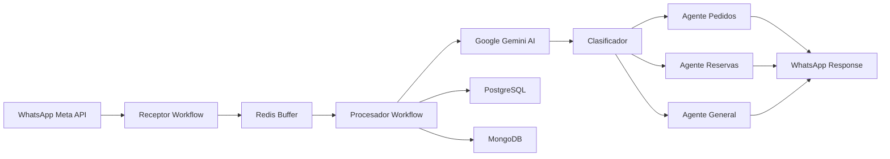

## Bienvenido a Automatización Lurwis

Automatización Lurwis es una plataforma de atención al cliente impulsada por inteligencia artificial, diseñada específicamente para **Picantería Lurwis** en Chiclayo, Perú. El sistema permite a los clientes hacer pedidos, reservar mesas y obtener información del restaurante directamente a través de WhatsApp, operando 24/7 con respuestas inteligentes y contextuales.

## ¿Qué hace este sistema?

Este sistema transforma la atención al cliente tradicional de un restaurante en una experiencia digital automatizada que:

<CardGroup cols={2}>
  <Card title="Gestión de Pedidos" icon="utensils">
    Los clientes pueden navegar por el menú completo, consultar precios por tamaño (Personal/Familiar), hacer pedidos con delivery o recojo, y recibir confirmaciones instantáneas.
  </Card>
  
  <Card title="Reservas Inteligentes" icon="calendar-check">
    Permite reservar mesas para 2-12 personas o coordinar eventos especiales para grupos grandes, con validación automática de disponibilidad.
  </Card>
  
  <Card title="Información 24/7" icon="circle-info">
    Responde preguntas sobre ubicación, horarios, métodos de pago (Yape, Plin, Efectivo, Tarjeta) y redes sociales sin intervención humana.
  </Card>
  
  <Card title="Memoria Contextual" icon="brain">
    Cada conversación se mantiene en contexto usando MongoDB, permitiendo que el bot recuerde pedidos anteriores y preferencias del cliente.
  </Card>
</CardGroup>

## Beneficios Clave

### Para el Restaurante

- **Reducción de carga operativa**: El 80% de las consultas se resuelven automáticamente sin intervención humana
- **Cero errores de transcripción**: Los pedidos se registran directamente en PostgreSQL con formato estructurado
- **Métricas en tiempo real**: Cada interacción se registra para análisis de ventas y comportamiento del cliente
- **Escalabilidad**: Atiende múltiples clientes simultáneamente sin límite de capacidad

### Para los Clientes

- **Respuesta instantánea**: Los mensajes se procesan en menos de 5 segundos
- **Disponibilidad total**: Pueden consultar el menú y hacer pedidos incluso fuera del horario de atención (10am-11pm)
- **Experiencia natural**: Conversan con "Wilson", un asistente que entiende lenguaje coloquial peruano
- **Confirmación clara**: Reciben resumen detallado del pedido con total, método de pago y tipo de servicio

## Arquitectura de Alto Nivel

El sistema está construido sobre una arquitectura de dos workflows principales:

<Note>
  El **Receptor** maneja webhooks de Meta y agrupa mensajes en Redis con TTL de 30 segundos. El **Procesador** se ejecuta cada 10 segundos para procesar los mensajes agrupados con agentes especializados.
</Note>

## Componentes Principales

### 1. n8n Workflows

La lógica de automatización está construida en n8n, una plataforma de automatización open-source que permite crear flujos visuales complejos sin código.

- **Picantería Lurwis | Receptor**: Punto de entrada que valida webhooks de Meta
- **Picantería Lurwis | Procesador**: Motor de IA que clasifica intenciones y ejecuta acciones

### 2. Agentes de IA (Google Gemini)

Cuatro agentes especializados potenciados por LangChain y Google Gemini:

- **Wilson - Clasificador**: Determina si el mensaje es sobre pedidos, reservas o información general
- **Wilson - Pedidos**: Navega el menú usando herramientas SQL y confirma órdenes
- **Wilson - Reservas de Mesas**: Gestiona disponibilidad para grupos de 2-12 personas
- **Wilson - Info General**: Responde preguntas frecuentes con información estática

### 3. Bases de Datos

**PostgreSQL** (Datos estructurados)
- Tabla `categorias`: Ceviches, Chicharrones, Sudados, etc.
- Tabla `platos`: Nombre, descripción y categoría de cada plato
- Tabla `plato_precios`: Precios por tamaño (Personal, Familiar, Único)
- Tabla `pedidos_picanteria`: Registro de todas las órdenes con estado

**MongoDB** (Memoria conversacional)
- Colecciones separadas por tipo de agente para mantener contexto histórico
- Permite continuidad en conversaciones interrumpidas

**Redis** (Buffer temporal)
- Agrupa mensajes rápidos del mismo usuario antes de procesarlos
- TTL de 30 segundos para auto-limpieza

### 4. Integración WhatsApp

Conexión directa con WhatsApp Business API (Meta) usando:
- Webhook para recepción de mensajes entrantes
- API de envío para respuestas automáticas
- Validación con `hub.verify_token` para seguridad

## Caso de Uso Real

Un cliente típico interactúa así:

<Steps>
  <Step title="Cliente envía mensaje">
    "Hola, quiero hacer un pedido" → Meta envía webhook al Receptor
  </Step>
  
  <Step title="Sistema agrupa mensajes">
    Si el cliente envía varios mensajes seguidos, Redis los concatena en 30 segundos
  </Step>
  
  <Step title="Clasificación inteligente">
    El Procesador detecta que es un pedido y activa el Agente Pedidos
  </Step>
  
  <Step title="Navegación del menú">
    Wilson muestra categorías → Cliente elige "Ceviches" → Muestra platos disponibles
  </Step>
  
  <Step title="Confirmación">
    Cliente dice "confirmo" → Sistema inserta en PostgreSQL → Envía resumen por WhatsApp
  </Step>
</Steps>

## Tecnologías Utilizadas

<CardGroup cols={3}>
  <Card title="n8n" icon="diagram-project">
    Orquestación de workflows visuales
  </Card>
  
  <Card title="Google Gemini" icon="robot">
    Modelos de lenguaje para agentes IA
  </Card>
  
  <Card title="PostgreSQL" icon="database">
    Almacenamiento de menú y pedidos
  </Card>
  
  <Card title="MongoDB" icon="leaf">
    Memoria conversacional de agentes
  </Card>
  
  <Card title="Redis" icon="bolt">
    Buffer temporal de mensajes
  </Card>
  
  <Card title="WhatsApp API" icon="whatsapp">
    Integración con Meta Business
  </Card>
</CardGroup>

## Manejo de Errores y Monitoreo

<Warning>
  El sistema incluye un **Error Workflow** configurado en n8n que envía notificaciones al WhatsApp personal del administrador cuando ocurre una falla crítica en el Receptor o Procesador.
</Warning>

Todos los pedidos confirmados se registran con:
- Timestamp de creación
- Detalles del pedido en formato JSON
- Estado (`confirmado`, `en_preparacion`, `entregado`, `cancelado`)
- Método de pago y tipo de servicio

## Próximos Pasos

Ahora que entiendes qué hace el sistema, continúa con:

<Card title="Quickstart" icon="rocket" href="/quickstart">
  Aprende a configurar el sistema desde cero e importar los workflows en tu instancia de n8n
</Card>

<Card title="Arquitectura" icon="sitemap" href="/architecture">
  Explora en detalle cómo interactúan los componentes y el flujo de datos completo
</Card>