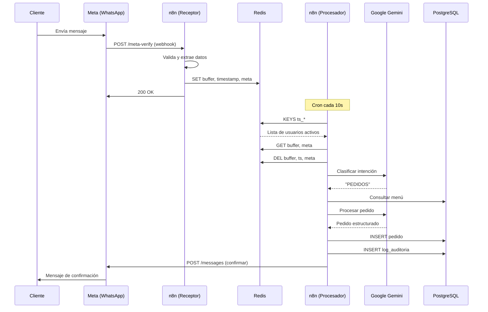

El sistema de Automatización Lurwis interactúa con múltiples APIs para recibir mensajes, enviar respuestas y gestionar buffers temporales.

## Webhook Principal - Meta (Facebook)

### POST `/meta-verify`

Webhook configurado en n8n que recibe eventos de WhatsApp Business API desde Meta (Facebook).

<ParamField path="hub.mode" query required>
  Modo de verificación enviado por Meta.
  
  Valor esperado: `subscribe`
</ParamField>

<ParamField path="hub.verify_token" query required>
  Token de verificación configurado en Meta Developer Console.
  
  Valor: `meta-verify`
</ParamField>

<ParamField path="hub.challenge" query>
  Challenge enviado por Meta durante la configuración inicial del webhook.
</ParamField>

#### Verificación inicial (GET)

Meta envía una petición GET para validar el webhook:

```http
GET /meta-verify?hub.mode=subscribe&hub.verify_token=meta-verify&hub.challenge=1234567890
```

<ResponseField name="response" type="string">
  El servidor debe responder con el valor exacto de `hub.challenge`.
</ResponseField>

<ResponseField name="status" type="number">
  Código HTTP 200 para verificación exitosa.
</ResponseField>

---

#### Recepción de mensajes (POST)

Cuando un cliente envía un mensaje por WhatsApp, Meta lo reenvía a este webhook:

<CodeGroup>
```json Ejemplo de Payload
{
  "object": "whatsapp_business_account",
  "entry": [
    {
      "id": "746650594705809",
      "changes": [
        {
          "value": {
            "messaging_product": "whatsapp",
            "metadata": {
              "display_phone_number": "15551933641",
              "phone_number_id": "947279508470714"
            },
            "contacts": [
              {
                "profile": {
                  "name": "Kevo"
                },
                "wa_id": "51900769907"
              }
            ],
            "messages": [
              {
                "from": "51900769907",
                "id": "wamid.HBgLNTE5MDA3Njk5MDcVAgASGBYzRUIwNDRDRDQ4MzBCQ0U5MjE0QTI2AA==",
                "timestamp": "1771142227",
                "text": {
                  "body": "Quiero hacer un pedido"
                },
                "type": "text"
              }
            ],
            "statuses": []
          },
          "field": "messages"
        }
      ]
    }
  ]
}
```
</CodeGroup>

<ResponseField name="entry[].changes[].value.messages[]" type="array">
  Array de mensajes recibidos. Puede estar vacío (mensaje de estado).
</ResponseField>

<ResponseField name="entry[].changes[].value.messages[].from" type="string">
  Número de teléfono del remitente en formato internacional.
</ResponseField>

<ResponseField name="entry[].changes[].value.messages[].text.body" type="string">
  Contenido del mensaje de texto enviado por el cliente.
</ResponseField>

<ResponseField name="entry[].changes[].value.metadata.phone_number_id" type="string">
  ID del número de WhatsApp Business usado para responder.
</ResponseField>

<ResponseField name="entry[].changes[].value.statuses[]" type="array">
  Array de actualizaciones de estado (entregado, leído). Cuando está presente, `messages` suele estar vacío.
</ResponseField>

---

### Validación y Filtrado

El webhook implementa múltiples capas de validación:

<Accordion title="1. Verificación de token">
  ```javascript
  if (hub.mode === 'subscribe' && hub.verify_token === 'meta-verify') {
    return hub.challenge; // Status 200
  } else {
    return 'Forbidden'; // Status 403
  }
  ```
</Accordion>

<Accordion title="2. Identificador de mensajes vacíos">
  Filtra ejecuciones donde:
  - `messages` está vacío
  - `text.body` está vacío
  - Solo hay `statuses` (sin mensaje nuevo)
  
  Esto evita procesar webhooks de confirmación de lectura o entrega.
</Accordion>

<Accordion title="3. Extractor de datos">
  Limpia y estructura los datos relevantes:
  
  ```javascript
  {
    from: "51900769907",
    "text.body": "Quiero hacer un pedido",
    "id cliente": "wamid.HBg...",
    "id mensajero": "947279508470714",
    profile_name: "Kevo",
    mensaje_real: true
  }
  ```
</Accordion>

---

## WhatsApp Business API (Meta)

### POST `https://graph.facebook.com/v21.0/{phone_number_id}/messages`

Endpoint oficial de Meta para enviar mensajes de WhatsApp.

<ParamField path="phone_number_id" type="string" required>
  ID del número de WhatsApp Business (obtenido desde el webhook entrante).
  
  Ejemplo: `947279508470714`
</ParamField>

#### Headers

```http
Authorization: Bearer {ACCESS_TOKEN}
Content-Type: application/json
```

#### Request Body

<CodeGroup>
```json Mensaje de texto
{
  "messaging_product": "whatsapp",
  "to": "51900769907",
  "type": "text",
  "text": {
    "body": "¡Hola! Bienvenido a Picantería Lurwis 🦐. ¿En qué puedo ayudarte?"
  }
}
```

```json Mensaje con formato
{
  "messaging_product": "whatsapp",
  "to": "51900769907",
  "type": "text",
  "text": {
    "body": "*Pedido Confirmado*\n\n🧾 Resumen:\n- 2x Ceviche Personal\n\n💰 Total: S/ 70.00"
  }
}
```
</CodeGroup>

<ParamField body="messaging_product" type="string" required>
  Siempre `whatsapp`
</ParamField>

<ParamField body="to" type="string" required>
  Número de teléfono del destinatario en formato internacional (sin signos +).
</ParamField>

<ParamField body="type" type="string" required>
  Tipo de mensaje.
  
  Valores soportados: `text`, `image`, `document`, `template`
</ParamField>

<ParamField body="text.body" type="string" required>
  Contenido del mensaje de texto. Soporta formato básico de WhatsApp:
  - `*negrita*`
  - `_cursiva_`
  - Emojis
</ParamField>

#### Response

<ResponseField name="messages[].id" type="string">
  ID único del mensaje enviado (WAMID).
</ResponseField>

<ResponseField name="messages[].message_status" type="string">
  Estado inicial del mensaje.
  
  Valores: `accepted`, `queued`
</ResponseField>

```json
{
  "messaging_product": "whatsapp",
  "contacts": [
    {
      "input": "51900769907",
      "wa_id": "51900769907"
    }
  ],
  "messages": [
    {
      "id": "wamid.HBgLNTE5MDA3Njk5MDcVAgARGBI4OTNENDI2MTFCNDBBQTE2AA==",
      "message_status": "accepted"
    }
  ]
}
```

<Warning>
  Si el token de acceso es inválido o el número no está registrado en WhatsApp Business, recibirás un error 401 o 403.
</Warning>

---

## Redis API (Upstash)

El sistema utiliza Redis para gestionar el buffer temporal de mensajes.

### SET - Guardar buffer

```redis
SET buffer_51900769907 "Hola\nQuiero hacer un pedido\n2 ceviches" EX 30
```

<ParamField path="key" type="string" required>
  Formato: `buffer_{telefono}`
</ParamField>

<ParamField path="value" type="string" required>
  Mensajes concatenados separados por saltos de línea (`\n`).
</ParamField>

<ParamField path="EX" type="number">
  TTL (Time To Live) en segundos. Por defecto: 30 segundos.
</ParamField>

---

### SET - Guardar timestamp

```redis
SET ts_51900769907 "1771142230000" EX 30
```

<ParamField path="key" type="string" required>
  Formato: `ts_{telefono}`
</ParamField>

<ParamField path="value" type="string" required>
  Timestamp Unix en milisegundos del último mensaje.
</ParamField>

---

### SET - Guardar metadata

```redis
SET meta_51900769907 "947279508470714" EX 120
```

<ParamField path="key" type="string" required>
  Formato: `meta_{telefono}`
</ParamField>

<ParamField path="value" type="string" required>
  ID del número de WhatsApp Business para responder.
</ParamField>

<ParamField path="EX" type="number">
  TTL: 120 segundos (mayor que buffer y timestamp).
</ParamField>

---

### GET - Leer buffer

```redis
GET buffer_51900769907
```

Retorna el contenido del buffer o `null` si no existe o expiró.

---

### KEYS - Buscar usuarios activos

```redis
KEYS ts_*
```

Retorna un array de todas las keys de timestamp activas (usuarios con mensajes pendientes).

```json
{
  "ts_51900769907": "1771142230000",
  "ts_51987654321": "1771142240000"
}
```

---

### DEL - Eliminar buffer procesado

```redis
DEL buffer_51900769907
DEL ts_51900769907
DEL meta_51900769907
```

Elimina todas las keys asociadas a un usuario después de procesar sus mensajes.

---

## Google Gemini API

El sistema utiliza modelos de Google Gemini a través de LangChain para los agentes IA.

### Modelos utilizados

<ParamField path="model" type="string">
  Modelo de IA utilizado.
  
  - **Gemini Flash:** Para clasificación rápida y detección de intenciones
  - **Gemini Pro:** Para el agente de pedidos (razonamiento complejo)
</ParamField>

<Note>
  Las credenciales de API se gestionan de forma segura en n8n con el nombre "Modelo Lurwis".
</Note>

---

## Resumen de Flujo de APIs



## Manejo de Errores

<Accordion title="Webhook - Error 403 Forbidden">
  Se envía cuando:
  - Token de verificación incorrecto
  - `hub.mode` no es "subscribe"
  
  **Solución:** Verificar configuración en Meta Developer Console.
</Accordion>

<Accordion title="WhatsApp API - Error 401/403">
  Token de acceso inválido o expirado.
  
  **Solución:** Regenerar token en Meta Business Manager.
</Accordion>

<Accordion title="Redis - Key no encontrada">
  Buffer expiró antes de ser procesado (TTL venció).
  
  **Solución:** Ajustar TTL o reducir intervalo del cron procesador.
</Accordion>

<Accordion title="PostgreSQL - Connection timeout">
  Conexión a base de datos falló.
  
  **Solución:** Verificar Session Pooler y credenciales en n8n.
</Accordion>