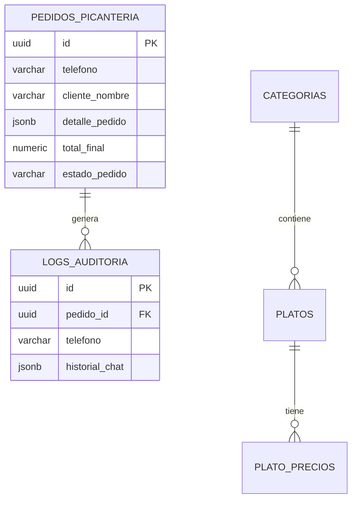

La Picantería Lurwis utiliza dos bases de datos para gestionar diferentes aspectos del sistema:
- **PostgreSQL:** Para datos transaccionales y del menú
- **MongoDB:** Para memoria conversacional de los agentes IA

## PostgreSQL - Base de Datos Relacional

### Tabla: `pedidos_picanteria`

Tabla principal que almacena todos los pedidos realizados por los clientes.

<ParamField path="id" type="uuid" required>
  Identificador único del pedido (Primary Key). Generado automáticamente.
</ParamField>

<ParamField path="telefono" type="varchar" required>
  Número de teléfono del cliente en formato internacional (ej: 51900769907). Utilizado como identificador principal del cliente.
</ParamField>

<ParamField path="cliente_nombre" type="varchar" required>
  Nombre completo del cliente extraído durante la conversación.
</ParamField>

<ParamField path="detalle_pedido" type="jsonb" required>
  Objeto JSON que contiene la descripción detallada del pedido.
  
  Estructura:
  ```json
  {
    "descripcion": "2x Ceviche Personal (S/ 35.00 c/u), 1x Parihuela Familiar (S/ 65.00)"
  }
  ```
</ParamField>

<ParamField path="total_estimado" type="numeric(10,2)">
  Cálculo preliminar del total antes de la confirmación final (campo may not be actively used - verify in actual database schema).
</ParamField>

<ParamField path="total_final" type="numeric(10,2)" required>
  Total confirmado que el cliente debe pagar.
</ParamField>

<ParamField path="metodo_pago" type="varchar" required>
  Método de pago elegido por el cliente.
  
  Valores posibles: `Yape`, `Plin`, `Efectivo`, `Tarjeta`
</ParamField>

<ParamField path="tipo_servicio" type="varchar" required>
  Tipo de servicio solicitado.
  
  Valores posibles: `Delivery`, `Recojo`
</ParamField>

<ParamField path="estado_pedido" type="varchar" required>
  Estado actual del pedido en el ciclo de vida.
  
  Valores posibles:
  - `confirmado` - Pedido recibido y confirmado
  - `en_preparacion` - Pedido en cocina
  - `en_camino` - Pedido enviado (solo Delivery)
  - `entregado` - Pedido completado
  - `cancelado` - Pedido cancelado
</ParamField>

<ParamField path="direccion" type="text">
  Dirección de entrega (solo para Delivery). Puede ser null si es Recojo.
</ParamField>

<ParamField path="fecha_creacion" type="timestamp">
  Fecha y hora de creación del registro. Generado automáticamente.
</ParamField>

<ParamField path="fecha_actualizacion" type="timestamp">
  Fecha y hora de última modificación. Se actualiza automáticamente.
</ParamField>

---

### Tabla: `logs_auditoria`

Tabla de auditoría que registra el historial completo de cada conversación asociada a un pedido.

<ParamField path="id" type="uuid" required>
  Identificador único del log (Primary Key). Generado automáticamente.
</ParamField>

<ParamField path="pedido_id" type="uuid" required>
  Referencia al ID del pedido en `pedidos_picanteria` (Foreign Key).
</ParamField>

<ParamField path="telefono" type="varchar" required>
  Número de teléfono del cliente. Duplicado para facilitar búsquedas.
</ParamField>

<ParamField path="nombre_cliente" type="varchar">
  Nombre del cliente al momento del registro.
</ParamField>

<ParamField path="historial_chat" type="jsonb" required>
  Array completo de mensajes intercambiados entre el cliente y Wilson (el agente IA).
  
  Estructura:
  ```json
  {
    "messages": [
      {
        "role": "user",
        "content": "Quiero hacer un pedido",
        "timestamp": "2026-03-05T10:30:00Z"
      },
      {
        "role": "assistant",
        "content": "¡Perfecto! Te muestro nuestras categorías...",
        "timestamp": "2026-03-05T10:30:02Z"
      }
    ]
  }
  ```
</ParamField>

<ParamField path="fecha_registro" type="timestamp">
  Fecha y hora en que se guardó el log. Generado automáticamente.
</ParamField>

<Note>
  Los logs de auditoría son críticos para:
  - Análisis de calidad de servicio
  - Resolución de disputas
  - Entrenamiento y mejora de los modelos IA
</Note>

---

### Tabla: `categorias`

Catálogo de categorías del menú.

<ParamField path="id" type="integer" required>
  ID numérico de la categoría (Primary Key).
</ParamField>

<ParamField path="nombre" type="varchar" required>
  Nombre de la categoría (ej: "Ceviches", "Chicharrones", "Sudados").
</ParamField>

<ParamField path="activo" type="boolean" default="true">
  Indica si la categoría está disponible en el menú actual.
</ParamField>

---

### Tabla: `platos`

Catálogo de platos disponibles en el menú.

<ParamField path="id" type="integer" required>
  ID numérico del plato (Primary Key).
</ParamField>

<ParamField path="categoria_id" type="integer" required>
  Referencia a la categoría (Foreign Key a `categorias.id`).
</ParamField>

<ParamField path="nombre" type="varchar" required>
  Nombre del plato (ej: "Ceviche Mixto", "Chicharrón de Pescado").
</ParamField>

<ParamField path="descripcion" type="text">
  Descripción detallada del plato con ingredientes y preparación.
</ParamField>

<ParamField path="activo" type="boolean" default="true">
  Indica si el plato está disponible actualmente.
</ParamField>

---

### Tabla: `plato_precios`

Precios diferenciados por tamaño para cada plato.

<ParamField path="id" type="integer" required>
  ID del registro de precio (Primary Key).
</ParamField>

<ParamField path="plato_id" type="integer" required>
  Referencia al plato (Foreign Key a `platos.id`).
</ParamField>

<ParamField path="tamanio" type="varchar" required>
  Tamaño de la porción.
  
  Valores posibles: `Personal`, `Familiar`, `Único`
</ParamField>

<ParamField path="precio" type="numeric(10,2)" required>
  Precio en soles (PEN) para este tamaño.
</ParamField>

<ParamField path="activo" type="boolean" default="true">
  Indica si este precio está vigente.
</ParamField>

---

## MongoDB - Base de Datos NoSQL

### Colección: `historial_clasificador`

Almacena la memoria conversacional del **Agente Clasificador** que determina la intención del cliente.

<ResponseField name="sessionId" type="string">
  ID de sesión correspondiente al número de teléfono del cliente.
</ResponseField>

<ResponseField name="messages" type="array">
  Array de mensajes intercambiados con el agente clasificador.
</ResponseField>

<ResponseField name="contextWindowLength" type="number">
  Cantidad de mensajes mantenidos en memoria (configurable).
</ResponseField>

---

### Colección: `historial_pedidos`

Memoria conversacional del **Agente Pedidos** que gestiona la toma de órdenes.

<ResponseField name="sessionId" type="string">
  Número de teléfono del cliente.
</ResponseField>

<ResponseField name="messages" type="array">
  Historial completo de la conversación sobre el pedido.
</ResponseField>

<ResponseField name="contextWindowLength" type="number">
  Configurado para 25 mensajes para mantener contexto extenso.
</ResponseField>

<Warning>
  Este historial es crítico para que el agente recuerde platos mencionados, precios cotizados y preferencias del cliente durante la conversación.
</Warning>

---

### Colección: `historial_detector`

Memoria del **Detector de Pedidos** que identifica si el cliente quiere modificar o consultar un pedido existente.

<ResponseField name="sessionId" type="string">
  Número de teléfono del cliente.
</ResponseField>

<ResponseField name="messages" type="array">
  Conversación utilizada para determinar intención (modificar vs. consultar).
</ResponseField>

---

### Colecciones adicionales

- **`historial_reservas`:** Memoria del agente de reservas de mesas (15 mensajes)
- **`historial_eventos`:** Memoria del agente de reservas de local (15 mensajes)
- **`historial_general`:** Memoria del agente de consultas generales (10 mensajes)

---

## Relaciones Clave



## Consultas Comunes

<Accordion title="Obtener pedidos pendientes de un cliente">
  ```sql
  SELECT id, detalle_pedido, total_final, estado_pedido 
  FROM pedidos_picanteria 
  WHERE TRIM(telefono) = TRIM('51900769907')
  AND estado_pedido NOT IN ('entregado', 'cancelado')
  ORDER BY fecha_creacion DESC
  LIMIT 1;
  ```
</Accordion>

<Accordion title="Consultar platos de una categoría">
  ```sql
  SELECT 
    p.id,
    p.nombre,
    p.descripcion,
    json_agg(
      json_build_object('tamanio', pp.tamanio, 'precio', pp.precio)
      ORDER BY pp.precio
    ) AS precios
  FROM platos p
  JOIN plato_precios pp ON pp.plato_id = p.id
  WHERE p.categoria_id = 1
  AND p.activo = true
  AND pp.activo = true
  GROUP BY p.id, p.nombre, p.descripcion;
  ```
</Accordion>

<Accordion title="Auditar conversación de un pedido">
  ```sql
  SELECT 
    p.id AS pedido_id,
    p.cliente_nombre,
    p.total_final,
    p.estado_pedido,
    l.historial_chat
  FROM pedidos_picanteria p
  LEFT JOIN logs_auditoria l ON l.pedido_id = p.id
  WHERE p.id = 'uuid-del-pedido';
  ```
</Accordion>

## Configuración de Conexión

<Note>
  La conexión a PostgreSQL utiliza **Session Pooler** para optimizar el manejo de conexiones concurrentes desde n8n.
  
  Todas las tablas implementan **Row Level Security (RLS)** para proteger datos sensibles de clientes.
</Note>