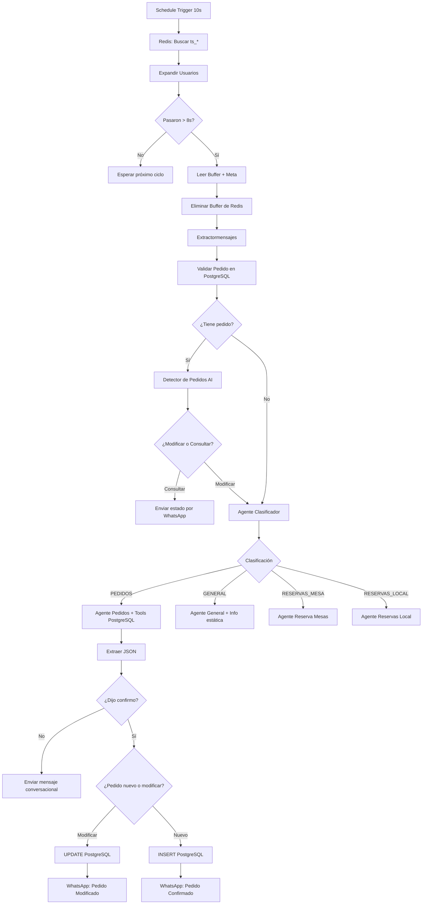
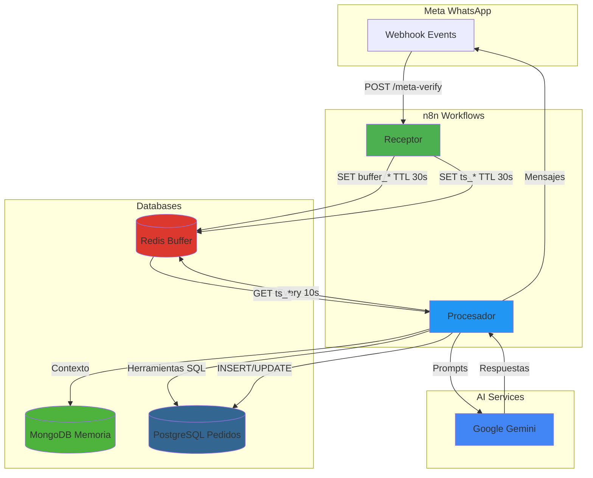

## Descripción General

El flujo **Procesador** es el cerebro de la automatización de Lurwis. Funciona de manera asíncrona al flujo Receptor, consumiendo mensajes agrupados desde Redis y orquestando múltiples agentes de inteligencia artificial especializados. Utiliza **Google Gemini** como modelo de lenguaje principal, **MongoDB** para memoria conversacional persistente, y **PostgreSQL** para gestión transaccional de pedidos.

<Info>
  **Arquitectura basada en agentes:** El sistema utiliza 5 agentes especializados (Clasificador, Detector, Pedidos, Reservas Mesas, Reservas Local, General) cada uno con su propia memoria y herramientas.
</Info>

## Trigger: Schedule Cron

**Nodo:** `Schedule Trigger`

El flujo NO depende de webhooks externos, sino que se ejecuta automáticamente mediante un trigger de tipo Schedule:

- **Intervalo:** Cada **10 segundos**
- **Configuración:** `secondsInterval: 10`
- **Propósito:** Buscar activamente en Redis usuarios con mensajes pendientes de procesar

<Note>
  **Diseño asíncrono:** El intervalo de 10 segundos es intencional para permitir que el flujo Receptor agrupe múltiples mensajes cortos enviados en rápida sucesión.
</Note>

## Flujo de Trabajo Completo

<Steps>

### Paso 1: Búsqueda de Usuarios Activos en Redis

**Nodo:** `Redis: Buscar usuarios activos` (Redis Keys)

```javascript
// Operación: Keys
// Patrón: "ts_*"
```

Busca todas las claves que comienzan con `ts_` (timestamps de usuarios con mensajes pendientes).

**Respuesta ejemplo:**
```json
{
  "ts_51900769907": "1771550707733",
  "ts_51987654321": "1771550710245"
}
```

### Paso 2: Expansión de Usuarios

**Nodo:** `Code: Expandir usuarios` (JavaScript Code)

Transforma el objeto de Redis en un array de items individuales para procesar cada usuario:

```javascript
const result = $input.first().json;
const keys = Object.keys(result).filter(k => k.startsWith('ts_'));

if (keys.length === 0) return [];

return keys.map(key => ({
  json: {
    tsKey: key,                             // "ts_51900769907"
    userId: key.replace('ts_', ''),        // "51900769907"
    bufferKey: key.replace('ts_', 'buffer_'), // "buffer_51900769907"
    metaKey: key.replace('ts_', 'meta_')   // "meta_51900769907"
  }
}));
```

<Info>
  **Split en múltiples ejecuciones:** n8n ejecuta los siguientes nodos una vez por cada usuario en paralelo.
</Info>

### Paso 3: Validación de Tiempo de Espera

**Nodo:** `Redis: Leer Timestamp` → `If`

Lee el timestamp del último mensaje y verifica que hayan pasado **más de 8 segundos** desde el último mensaje del usuario:

```javascript
// Condición
Date.now() - Number($json.value) > 8000
```

**Lógica:**
- Si el usuario escribió hace **< 8 segundos:** **NO procesar** (puede seguir escribiendo)
- Si pasaron **> 8 segundos:** **SÍ procesar** (finalizó su input)

<Warning>
  **Balance crucial:** 8 segundos es el equilibrio entre respuesta rápida y evitar cortar al usuario mientras escribe.
</Warning>

### Paso 4: Lectura y Limpieza del Buffer

#### 4.1 Lectura de Datos

Tres nodos Redis en paralelo:

1. **`Redis: Leer Buffer`** → Lee `buffer_<userId>` (mensajes concatenados)
2. **`Redis: Leer Meta`** → Lee `meta_<userId>` (Phone Number ID para responder)
3. **`Redis: Eliminar Buffer`** → Elimina `buffer_<userId>`
4. **`Redis: Eliminar Timestamp`** → Elimina `ts_<userId>`

<Note>
  **Consumo atómico:** Los datos se leen y eliminan inmediatamente para evitar procesamiento duplicado.
</Note>

#### 4.2 Formateo de Datos

**Nodo:** `Extractormensajes` (JavaScript Code)

Transforma los datos de Redis en el formato esperado por los agentes:

```javascript
const bufferData = $('Redis: Leer Buffer').item.json;
const metaData   = $('Redis: Leer Meta').item.json;
const userData   = $('Code: Expandir usuarios').item.json;

const rawBuffer   = bufferData.value || '';
const idMensajero = metaData.value  || '947279508470714';

// Unir mensajes separados por \n en un solo texto con espacios
const mensajesUnidos = rawBuffer
  .split('\n')
  .map(m => m.trim())
  .filter(m => m.length > 0)
  .join(' ');

// Guardia: si no hay mensaje, detener sin error
if (!mensajesUnidos || mensajesUnidos.length === 0) return [];

return {
  json: {
    from: userData.userId,
    'text.body': mensajesUnidos,
    text: { body: mensajesUnidos },
    'id mensajero': idMensajero,
    'id cliente': `buf_${Date.now()}`,
    profile_name: 'Cliente',
    buffered: true,
    messageCount: rawBuffer.split('\n').filter(m => m.trim()).length
  }
};
```

**Ejemplo de transformación:**
- Buffer Redis: `"Hola\nQuiero\nUn ceviche"`
- Output: `"Hola Quiero Un ceviche"`

### Paso 5: Control de Horario de Atención

**Nodo:** `Verificar Horario` (If) — *Mencionado en documentación original*

Antes de procesar la intención, verifica la hora actual del servidor (Zona horaria: America/Lima):

- **Horario de atención:** 10:00 AM - 11:00 PM
- **Fuera de horario:** Envía mensaje automático de "Local Cerrado" con los horarios
- **Dentro de horario:** Continúa al flujo de clasificación

<Warning>
  **Nota:** Este nodo no aparece explícitamente en el JSON del workflow pero está documentado en la especificación original. Puede estar implementado en una versión anterior o ser parte de lógica futura.
</Warning>

### Paso 6: Validación de Pedido Pendiente

**Nodo:** `Validar si tiene pedido o no` (PostgreSQL)

Consulta la base de datos para verificar si el cliente tiene un pedido activo:

```sql
SELECT id, detalle_pedido, total_final, estado_pedido 
FROM pedidos_picanteria 
WHERE TRIM(telefono) = TRIM('{{ $('Extractormensajes').item.json.from }}')
AND estado_pedido NOT IN ('entregado', 'cancelado')
LIMIT 1
```

**Configuración:**
- `alwaysOutputData: true` → Siempre devuelve resultado (vacío si no hay pedido)
- `onError: continueErrorOutput` → Continúa el flujo incluso si falla la query

#### Bifurcación según resultado

**Nodo:** `¿Tiene Pedido Pendiente?` (If)

```javascript
// Condición
$json.id !== empty
```

- **Tiene pedido:** → `Detector de pedidos` (Agente especializado)
- **No tiene pedido:** → `Agente Clasificador` (flujo normal)

### Paso 7A: Flujo con Pedido Existente

**Nodo:** `Detector de pedidos` (AI Agent)

**Propósito:** Distinguir si el cliente quiere:
1. **Modificar** su pedido existente (añadir, cambiar, actualizar)
2. **Consultar** el estado de su pedido

**System Prompt (resumido):**
```
Analiza la intención del cliente:

Si el cliente quiere:
- Hacer un pedido nuevo
- Modificar su pedido actual
- Añadir más productos
Responde: "ACCIÓN:MODIFICAR - [explicación]"

Si el cliente SOLO quiere:
- Saber el estado de su pedido
- Consultar información
Responde: "ACCIÓN:CONSULTAR - El estado actual es: {{ estado_pedido }}"
```

**Memoria:** MongoDB Collection `historial_detector`

#### Análisis de Intención

**Nodo:** `Analizador Intención Flexible` (JavaScript Code)

Procesa la respuesta del agente y categoriza usando palabras clave:

```javascript
const respuesta = $json.output.toLowerCase();

// Palabras clave que indican modificación
const palabrasModificar = [
  'modificar', 'cambiar', 'añadir', 'agregar',
  'actualizar', 'editar', 'quiero', 'comprar',
  'pedir', 'delivery', 'pedido', 'orden'
];

// Palabras clave que indican solo consulta
const palabrasConsultar = [
  'estado', 'consultar', 'saber', 'información',
  'cuánto falta', '¿cómo va', 'avance'
];

// Contar coincidencias y decidir
let accion = (puntosModificar > puntosConsultar) ? "MODIFICAR" : "CONSULTAR";

return {
  json: {
    output: $json.output,
    accion: accion,
    puntos_modificar: puntosModificar,
    puntos_consultar: puntosConsultar
  }
};
```

#### Bifurcación de Acción

**Nodo:** `¿Qué eligió el cliente?` (Switch)

- **Output "No modifica":** → `Nodo INFO de pedido` (envía estado actual por WhatsApp)
- **Output "Modifica":** → `Agente Clasificador` (continúa al flujo normal)

### Paso 7B: Flujo sin Pedido (Normal)

**Nodo:** `Agente Clasificador` (AI Agent)

**Propósito:** Categorizar la intención del mensaje en una de 4 rutas principales.

**System Prompt (simplificado):**
```
Eres un clasificador experto de intenciones para un restaurante.

⚠️ REGLA DE ORO (PRIORIDAD MÁXIMA):
Si el usuario menciona palabras como "pedido", "pedir", "comer", "hambre", 
"quiero", "menú" o nombres de comida, la categoría ES "PEDIDOS".

⚠️ REGLA DE CONTINUIDAD:
Revisa el historial. Si ya clasificaste como PEDIDOS y el mensaje actual 
es una respuesta dentro de ese flujo (nombre, dirección, confirmación), 
responde con LA MISMA categoría.

Categorías:
1. PEDIDOS (Prioridad Alta)
2. RESERVAS_MESA
3. RESERVAS_LOCAL
4. GENERAL (Prioridad Baja)

Responde SOLO con: PEDIDOS, RESERVAS_MESA, RESERVAS_LOCAL o GENERAL.
```

**Memoria:** MongoDB Collection `historial_clasificador`
**Modelo:** Google Gemini (fast model para clasificación rápida)

<Info>
  **Contexto conversacional:** El agente recuerda conversaciones previas del mismo número de teléfono, permitiendo continuidad en flujos multi-mensaje.
</Info>

### Paso 8: Enrutamiento a Agentes Especializados

**Nodo:** `Clasificador especializado a cada Agente` (Switch)

Dirige el flujo según la clasificación:

| Output | Agente Destino | Estado |
|--------|----------------|--------|
| `PEDIDOS` | Agente Pedidos | ✅ Producción (lógica completa) |
| `GENERAL` | Agente General | ✅ Producción |
| `RESERVAS_MESA` | Agente Reserva Mesas | ⚠️ En desarrollo (falta lógica) |
| `RESERVAS_LOCAL` | Agente Reservas Local | ⚠️ En desarrollo (falta lógica) |

### Paso 9: Agentes Especializados

#### 9.1 Agente Pedidos (Producción)

**Nodo:** `Agente Pedidos` (AI Agent)

**Rol:** Wilson, asistente de pedidos de Picantería Lurwis

**Características:**
- **Modelo:** Google Gemini (thinking model para razonamiento complejo)
- **Memoria:** MongoDB Collection `historial_pedidos` (25 mensajes de contexto)
- **Herramientas disponibles:**
  1. `consultar_categorias` → PostgreSQL Tool (lista categorías activas)
  2. `consultar_platos` → PostgreSQL Tool (lista platos por categoría con precios)
  3. `verificar_plato` → PostgreSQL Tool (calcula precio exacto + cantidad + subtotal)

**System Prompt (puntos clave):**

<Accordion title="Ver reglas principales del Agente Pedidos">

```xml
<REGLAS_DE_FORMATO>
- NUNCA incluyas texto técnico como "[Used tools:" o "Tool:"
- Respuesta es SOLO el mensaje final para WhatsApp
- Usa *negrita* ÚNICAMENTE para:
  1. Total final
  2. Palabra "confirmo"
  3. Tipo de servicio (Recojo/Delivery)
  4. Método de pago
  5. Nombre del cliente
</REGLAS_DE_FORMATO>

<LIMITES_DEL_MENU>
⚠️ REGLA DE SENTIDO COMÚN:
Eres asistente de PICANTERÍA (pescados, mariscos, comida criolla).
- Si piden pizza, hamburguesa, pollo a la brasa, sushi: RECHAZAR amablemente
- No digas "voy a buscar" esos platos
- Ofrece categorías reales con humor
</LIMITES_DEL_MENU>

<POLITICA_DE_PRECIOS>
- Precios de 'verificar_plato' son SAGRADOS
- Si cliente regatea: RECHAZA el descuento, pregunta si acepta precio oficial
- NO pidas "confirmo" hasta que acepte el precio
</POLITICA_DE_PRECIOS>

<FLUJO_OBLIGATORIO>
1. Obtener nombre completo del cliente
2. Navegar por categorías y platos usando herramientas
3. Calcular subtotales con verificar_plato
4. Preguntar método de pago (Yape/Plin/Efectivo/Tarjeta)
5. Preguntar tipo de servicio (Delivery con dirección / Recojo en local)
6. EXIGIR palabra exacta "confirmo" del cliente
7. Generar JSON con estructura:
{
  "nombre": "string",
  "direccion": "string o 'Recojo en local'",
  "pedido": "string descriptivo",
  "total": number,
  "metodopago": "string",
  "tiposervicio": "Delivery o Recojo"
}
</FLUJO_OBLIGATORIO>
```

</Accordion>

**Herramientas PostgreSQL:**

<Accordion title="Ver queries SQL de las herramientas">

**1. consultar_categorias**
```sql
SELECT id, nombre 
FROM categorias 
WHERE activo = true 
ORDER BY id
```

**2. consultar_platos**
```sql
SELECT 
  p.id,
  p.nombre,
  p.descripcion,
  json_agg(
    json_build_object('tamanio', pp.tamanio, 'precio', pp.precio)
    ORDER BY pp.precio
  ) AS precios
FROM platos p
JOIN plato_precios pp ON pp.plato_id = p.id
WHERE p.categoria_id = {{ $fromAI('categoriaid', 'ID numérico de la categoría elegida', 'number') }}
AND p.activo = true
AND pp.activo = true
GROUP BY p.id, p.nombre, p.descripcion
ORDER BY p.nombre
```

**3. verificar_plato**
```sql
SELECT 
  p.nombre,
  pp.tamanio,
  pp.precio AS precio_unitario,
  {{ $fromAI('cantidad', 'Cantidad de unidades, default 1', 'number') }}::int AS cantidad,
  (pp.precio * {{ $fromAI('cantidad', 'Cantidad, default 1', 'number') }}::int) AS subtotal
FROM platos p
JOIN plato_precios pp ON pp.plato_id = p.id
WHERE p.id = {{ $fromAI('platoid', 'ID numérico del plato', 'number') }}
AND LOWER(pp.tamanio) = LOWER('{{ $fromAI('tamanio', 'Tamaño: Personal, Familiar o Único', 'string') }}')
AND p.activo = true
AND pp.activo = true
```

</Accordion>

#### 9.2 Agente General (Producción)

**Nodo:** `Agente General` (AI Agent)

**Rol:** Wilson - Info, especialista en atención al cliente

**Características:**
- **Modelo:** Google Gemini (fast model)
- **Memoria:** MongoDB Collection `historial_general` (10 mensajes)
- **Herramientas:** `buscar_info_general` (código estático)

**System Prompt (reglas clave):**
```
<reglas_criticas>
1. SILENCIO SOBRE HERRAMIENTAS: NUNCA digas "voy a consultar" o "déjame revisar"
2. Ejecuta herramientas de forma invisible
3. NO ALUCINAR: NUNCA inventes horarios, direcciones o precios
4. Si preguntan cosas fuera de contexto (precios, disponibilidad), deriva a otras áreas
</reglas_criticas>

<regla_de_derivacion>
Si notas intención de compra, di EXACTAMENTE:
"Si deseas ver nuestro menú y ordenar, por favor responde: *Quiero hacer un pedido* 📝🦐"
</regla_de_derivacion>
```

**Información que maneja:**
- Ubicación: Chiclayo (con enlace Google Maps)
- Métodos de pago: Yape, Plin, Efectivo, Tarjeta
- Horarios de atención
- Redes sociales

#### 9.3 Agente Reserva Mesas (En Desarrollo)

**Nodo:** `Agente Reserva Mesas` (AI Agent)

**Estado:** ⚠️ Lógica pendiente, collections de MongoDB por crear

**Propósito:** Gestionar reservas de mesas (2-12 personas)
- Obtener: Fecha, hora, número de comensales
- Validar disponibilidad
- Solicitar número de contacto
- Registrar reserva

#### 9.4 Agente Reservas Local (En Desarrollo)

**Nodo:** `Agente Reservas Local` (AI Agent)

**Estado:** ⚠️ Lógica pendiente, collections de MongoDB por crear

**Propósito:** Gestionar alquiler de local para eventos
- Identificar tipo de evento (cumpleaños, corporativo)
- Recolectar: Fecha, cantidad de invitados, servicios extra
- Explicar ventajas del local
- Coordinar con humano para presupuesto formal

### Paso 10: Procesamiento de Pedidos Confirmados

#### 10.1 Extracción de Datos del Agente

**Nodo:** `Code in JavaScript`

Procesa la salida del Agente Pedidos para extraer el JSON estructurado:

```javascript
const agenteOutput = $('Agente Pedidos').first()?.json?.output ?? '';
const textoUsuario = $('Extractormensajes').first().json.text?.body ?? '';

// DETECCIÓN CONFIRMACIÓN ESTRICTA
const esConfirmacion = /\bconfirm[oa]\b/i.test(textoUsuario);

// Si NO dijo "confirmo", forzar totalfinal = 0 (NO va a DB)
if (!esConfirmacion) {
    return [{ json: {
        output: agenteOutput,
        totalfinal: 0,  // FRENO DE MANO
        from: datosUsuario.from,
        'id mensajero': datosUsuario.idMensajero
    }}];
}

// SI DIJO CONFIRMO, extraer JSON
const matchJSON = agenteOutput.match(/\{[\s\S]*?\}/);
if (matchJSON) {
    try {
        datosParsed = JSON.parse(matchJSON[0]);
    } catch(e) {}
}

const totalFinal = parseFloat(datosParsed?.total ?? 0) || 0;

// Ocultar JSON del mensaje al cliente
const outputFinal = agenteOutput.replace(/\{[\s\S]*?\}/g, '').trim();

return [{ json: {
  output: outputFinal,
  nombre: datosParsed?.nombre,
  direccion: datosParsed?.direccion,
  pedidodetallado: datosParsed?.pedido,
  total: totalFinal,
  metodopago: datosParsed?.metodopago,
  tiposervicio: datosParsed?.tiposervicio,
  totalfinal: totalFinal,
  from: datosUsuario.from,
  'id mensajero': datosUsuario.idMensajero
}}];
```

**Validación clave:**
- ✅ Cliente debe decir explícitamente "confirmo" o "confirma"
- ✅ JSON debe contener estructura válida
- ✅ Total debe ser > 0

#### 10.2 Validación de Venta Final

**Nodo:** `¿Es Venta Final?` (If)

```javascript
// Condición
$json.totalfinal > 0
```

- **totalfinal = 0:** Envía mensaje conversacional sin guardar en DB
- **totalfinal > 0:** Procede a guardar en PostgreSQL

#### 10.3 Determinar Operación (Insert o Update)

**Nodo:** `¿Es pedido nuevo o existente?` (If)

```javascript
// Condición
$('Validar si tiene pedido o no').first().json.id !== empty
```

- **Tiene pedido existente:** → `Modificar Pedido` (UPDATE)
- **No tiene pedido:** → `Insertar Pedido` (INSERT)

#### 10.4 Modificar Pedido Existente

**Nodo:** `Modificar Pedido` (PostgreSQL)

```sql
UPDATE pedidos_picanteria 
SET 
  cliente_nombre = '{{ $json.nombre }}',
  detalle_pedido = '{{ JSON.stringify({descripcion: $json.pedidodetallado}) }}'::jsonb,
  total_final = {{ $json.total }},
  metodo_pago = '{{ $json.metodopago }}',
  tipo_servicio = '{{ $json.tiposervicio }}',
  estado_pedido = 'confirmado'
WHERE id = '{{ $('Validar si tiene pedido o no').first().json.id }}'::uuid
RETURNING id;
```

**Manejo de error:**
- **Éxito:** → `Enviar mensaje FInal Modificado` (WhatsApp)
- **Error:** → `Notificar Error DB - Modificar` (WhatsApp con código de error)

#### 10.5 Insertar Pedido Nuevo

**Nodo:** `Insertar Pedido` (PostgreSQL) — *Mencionado en spec original, no visible en JSON*

```sql
INSERT INTO pedidos_picanteria (
  telefono,
  cliente_nombre,
  detalle_pedido,
  total_final,
  metodo_pago,
  tipo_servicio,
  estado_pedido,
  fecha_creacion
) VALUES (
  '{{ $json.from }}',
  '{{ $json.nombre }}',
  '{{ JSON.stringify({descripcion: $json.pedidodetallado}) }}'::jsonb,
  {{ $json.total }},
  '{{ $json.metodopago }}',
  '{{ $json.tiposervicio }}',
  'confirmado',
  NOW()
)
RETURNING id;
```

**Manejo de error:**
- **Éxito:** → `Enviar mensaje FInal nuevo Pedido` (WhatsApp)
- **Error:** → `Notificar Error DB - Insertar` (WhatsApp con código de error)

### Paso 11: Notificaciones Finales por WhatsApp

#### Mensaje de Pedido Confirmado (Nuevo)

**Nodo:** `Enviar mensaje FInal nuevo Pedido` (WhatsApp)

```text
¡Pedido Confirmado! ✅

Hola {{ nombre }} 👋, hemos recibido tu orden exitosamente ¡tu orden ya está en cocina! 👨‍🍳.

🧾 *Resumen del Pedido:*
{{ pedidodetallado }}

💰 *Total a pagar:* S/ {{ total }}
💳 *Método de pago:* {{ metodopago }}
🛵 *Tipo de servicio:* {{ tiposervicio }}

En cuanto su pedido esté listo le avisaremos 💫.
Gracias por su compra, Picantería Lurwis les desea buen provecho 🦐
```

#### Mensaje de Pedido Modificado

**Nodo:** `Enviar mensaje FInal Modificado` (WhatsApp)

```text
¡Pedido modificado Confirmado! ✅

Listo! {{ nombre }} 👋, hemos actualizado tu orden correctamente con los cambios. Así quedó tu pedido final:

🧾 *Nuevo resumen del Pedido:*
{{ pedidodetallado }}

💰 *Total a pagar:* S/ {{ total }}
💳 *Método de pago:* {{ metodopago }}
🛵 *Tipo de servicio:* {{ tiposervicio }}

En cuanto su pedido esté listo le avisaremos 💫.
Gracias por su compra, Picantería Lurwis les desea buen provecho 🦐
```

#### Mensajes de Error

**Formato de referencia:**
```text
😔 Lo sentimos, hubo un problema al procesar tu pedido.

Por favor, intenta nuevamente en unos minutos o contáctanos directamente.

Referencia del error: MOD-20260305143022
```

</Steps>

## Diagrama de Flujo Simplificado



## Arquitectura de Datos

### PostgreSQL (Transaccional)

**Credencial:** `Postgres Lurwis db` (ID: `5nRuBkRnPEOnj0KP`)

**Tablas principales:**

<Accordion title="Esquema de pedidos_picanteria">

```sql
CREATE TABLE pedidos_picanteria (
  id UUID PRIMARY KEY DEFAULT gen_random_uuid(),
  telefono VARCHAR(20) NOT NULL,
  cliente_nombre VARCHAR(255),
  detalle_pedido JSONB NOT NULL,
  total_final DECIMAL(10,2) NOT NULL,
  metodo_pago VARCHAR(50),
  tipo_servicio VARCHAR(20), -- 'Delivery' o 'Recojo'
  estado_pedido VARCHAR(50) NOT NULL, -- 'confirmado', 'entregado', 'cancelado'
  fecha_creacion TIMESTAMP DEFAULT NOW()
);

CREATE INDEX idx_telefono ON pedidos_picanteria(telefono);
CREATE INDEX idx_estado ON pedidos_picanteria(estado_pedido);
```

</Accordion>

<Accordion title="Esquema de categorias y platos">

```sql
CREATE TABLE categorias (
  id SERIAL PRIMARY KEY,
  nombre VARCHAR(100) NOT NULL,
  activo BOOLEAN DEFAULT true
);

CREATE TABLE platos (
  id SERIAL PRIMARY KEY,
  categoria_id INT REFERENCES categorias(id),
  nombre VARCHAR(200) NOT NULL,
  descripcion TEXT,
  activo BOOLEAN DEFAULT true
);

CREATE TABLE plato_precios (
  id SERIAL PRIMARY KEY,
  plato_id INT REFERENCES platos(id),
  tamanio VARCHAR(50), -- 'Personal', 'Familiar', 'Único'
  precio DECIMAL(10,2) NOT NULL,
  activo BOOLEAN DEFAULT true
);
```

</Accordion>

### MongoDB (Memoria Conversacional)

**Credencial:** `Memoria chats Lurwis` (ID: `rEzqy3CH5hFmOQ2S`)
**Base de datos:** `picanteria_db`

**Collections por agente:**

| Collection | Agente | Context Window | Estado |
|------------|--------|----------------|--------|
| `historial_clasificador` | Agente Clasificador | Default | ✅ Producción |
| `historial_detector` | Detector de pedidos | Default | ✅ Producción |
| `historial_pedidos` | Agente Pedidos | 25 mensajes | ✅ Producción |
| `historial_general` | Agente General | 10 mensajes | ✅ Producción |
| `historial_reservas` | Reserva Mesas | 15 mensajes | ⚠️ Por crear |
| `historial_eventos` | Reservas Local | 15 mensajes | ⚠️ Por crear |

<Info>
  **Session Keys:** Todas las memorias usan el número de teléfono (`from`) como clave de sesión, permitiendo contexto persistente por usuario.
</Info>

### Redis (Buffer Temporal)

**Credencial:** `Buffer Lurwis` (ID: `LuOIeLYx2ps0SCoP`)

**Patrón de claves consumidas:**
- `buffer_<userId>` → Mensajes concatenados (consumido y eliminado)
- `ts_<userId>` → Timestamp último mensaje (consumido y eliminado)
- `meta_<userId>` → Phone Number ID (consumido pero persiste hasta TTL)

## Tecnologías Utilizadas

| Componente | Tecnología | Uso |
|------------|------------|-----|
| **Scheduler** | n8n Schedule Trigger | Ejecución cada 10 segundos |
| **LLM Principal** | Google Gemini | Agentes de IA (modelos flash/thinking) |
| **Memoria Conversacional** | MongoDB + LangChain | Contexto persistente por usuario |
| **Base de Datos Transaccional** | PostgreSQL | Pedidos, menú, precios |
| **Buffer de Mensajes** | Redis | Agrupación temporal |
| **Mensajería** | WhatsApp Business API | Envío de respuestas |
| **Orquestador** | n8n | Workflow engine |

## Credenciales Configuradas

<Warning>
  **Seguridad:** Todas las credenciales están almacenadas en el sistema de credenciales cifrado de n8n. Nunca expongas estos IDs en el código del cliente.
</Warning>

| Servicio | Nombre | ID Interno |
|----------|--------|------------|
| PostgreSQL | Postgres Lurwis db | `5nRuBkRnPEOnj0KP` |
| MongoDB | Memoria chats Lurwis | `rEzqy3CH5hFmOQ2S` |
| Redis | Buffer Lurwis | `LuOIeLYx2ps0SCoP` |
| Google Gemini | Modelo Lurwis | `EGUpckskyMrPNfc4` |
| WhatsApp API | WhatsApp account | `zJi8oUdszoG5oEqW` |

## Manejo de Errores

### Estrategias por Tipo de Error

<Steps>

### Redis Vacío

Si no hay claves `ts_*`, el flujo termina sin error (ejecución vacía).

### Buffer sin Contenido

El nodo `Extractormensajes` retorna array vacío si `mensajesUnidos` está vacío, deteniendo el flujo limpiamente.

### Error de Agente de IA

Si un agente falla:
- **Detector de pedidos:** `retryOnFail: false`, `waitBetweenTries: 5000`
- No propaga error, devuelve salida vacía

### Error de PostgreSQL

Operaciones de INSERT/UPDATE tienen manejo de error:
- **onError:** continueErrorOutput
- **Ruta de error:** Envía mensaje de disculpa al cliente por WhatsApp con código de referencia temporal

### Error Global del Workflow

**Configurado en settings del workflow:**
- Conectado a "Error Workflow" que notifica al WhatsApp personal del administrador

</Steps>

## Optimizaciones y Consideraciones

### Performance

<Note>
  **Ejecución paralela:** n8n procesa múltiples usuarios simultáneamente cuando hay varios buffers listos.
</Note>

- **Modelo rápido para clasificación:** Usa Gemini Flash (fast) en Clasificador y Detector
- **Modelo pensante para pedidos:** Usa Gemini (thinking) en Agente Pedidos para lógica compleja
- **Índices de PostgreSQL:** Tablas tienen índices en `telefono` y `estado_pedido`

### Context Window por Agente

| Agente | Mensajes | Justificación |
|--------|----------|---------------|
| Pedidos | 25 | Conversaciones largas con múltiples platos |
| Reservas | 15 | Flujo más corto, datos puntuales |
| General | 10 | Preguntas simples, pocas iteraciones |
| Clasificador/Detector | Default | Solo necesita último contexto |

### Zona Horaria

Todo el sistema opera en **America/Lima** (UTC-5).

## Estado del Proyecto

<Warning>
  **MVP en Producción:**
  - ✅ Agente Pedidos (funcional completo)
  - ✅ Agente General (funcional completo)
  - ⚠️ Agentes de Reservas (estructura creada, lógica pendiente)
  - ⚠️ CRM en desarrollo
</Warning>

**Según notas del desarrollador:**
> "Solamente está probada para ver si funciona correctamente, sería cuestión de cambiar el orden ya, ya funcionó, ahora toca ponerlo bonito xd."

## Monitoreo y Auditoría

**Tabla de logs (mencionada en spec original):**
- `logs_auditoria` → Guarda historial de chat al confirmar pedidos
- Permite trazabilidad completa de conversaciones

## Integración con CRM

<Info>
  **En desarrollo:** Sistema de gestión de relaciones con clientes que consumirá los datos de PostgreSQL. La base de datos tiene Row-Level Security (RLS) configurado para acceso seguro.
</Info>

## Diagrama de Arquitectura Completa



## Próximos Pasos

<Steps>

### Completar Agentes de Reservas

- Implementar lógica de validación de disponibilidad
- Crear collections de MongoDB
- Conectar con sistema de calendario

### Implementar Logs de Auditoría

- Guardar historial completo en `logs_auditoria`
- Implementar consultas de métricas

### Desarrollar CRM

- Dashboard de pedidos en tiempo real
- Gestión de estado de pedidos
- Reportes de ventas

### Mejorar Seguridad

- Implementar validación de firma HMAC en Receptor
- Encriptar datos sensibles en PostgreSQL
- Rotar credenciales de API periódicamente

</Steps>

## Recursos Relacionados

- [Flujo Receptor](/workflows/receptor) - Punto de entrada de webhooks
- [Arquitectura del Sistema](/architecture) - Visión general
- [Google Gemini Integration](/integrations/google-gemini) - Configuración de AI y modelos