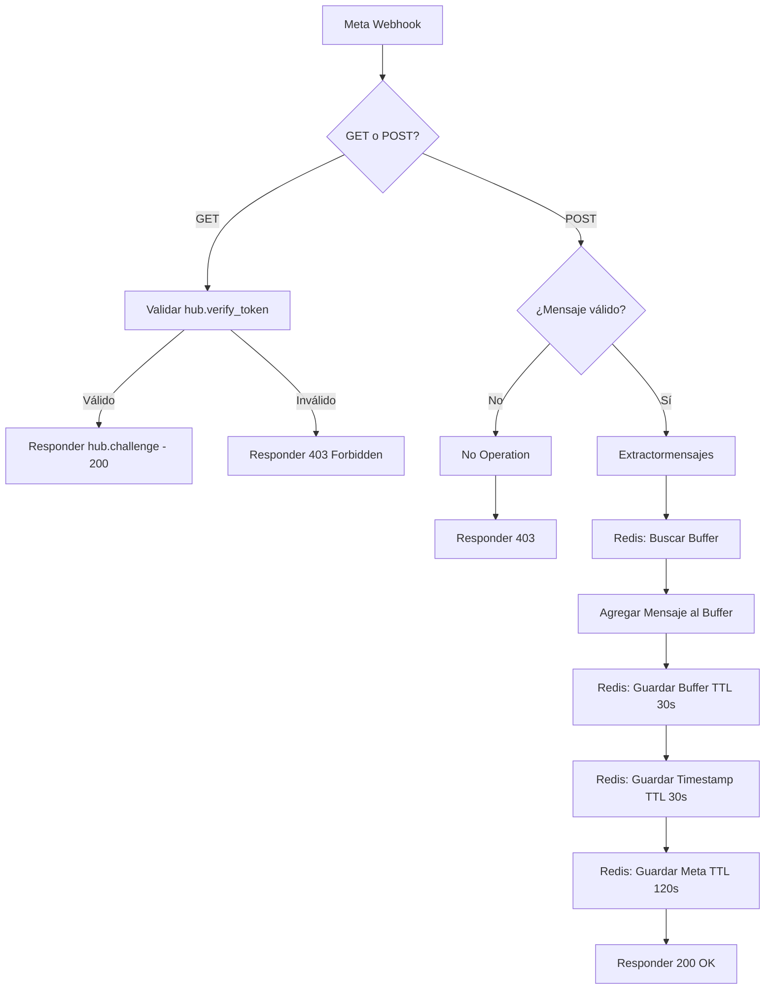

## Descripción General

El flujo **Receptor** es el punto de entrada crítico de la automatización de Lurwis. Actúa como gateway entre Meta (WhatsApp Business API) y el sistema de procesamiento interno. Su función principal es recibir webhooks de manera instantánea, validar su autenticidad, filtrar eventos irrelevantes y agrupar mensajes múltiples de un mismo usuario usando Redis como buffer temporal.

<Info>
  **Arquitectura asíncrona:** Este flujo responde inmediatamente a Meta (200 OK) y delega el procesamiento al flujo Procesador, evitando timeouts.
</Info>

## Configuración del Webhook

El flujo utiliza un nodo **Webhook** de n8n configurado para recibir peticiones de la API de WhatsApp Business:

- **Ruta:** `/meta-verify`
- **Métodos HTTP:** GET (verificación) y POST (mensajes)
- **Modo de respuesta:** `responseNode` (control manual de respuestas)
- **ID del Webhook:** `44c93f39-fc17-4ae4-b36e-034e7bdd40c4`

<Warning>
  Este webhook debe estar expuesto públicamente con HTTPS válido para que Meta pueda enviar eventos. Se recomienda usar un proxy reverso (Caddy/Nginx) con certificado SSL.
</Warning>

## Flujo de Trabajo Detallado

<Steps>

### Paso 1: Verificación de Meta (Challenge)

Cuando Meta intenta verificar el webhook (suscripción inicial), envía una petición GET con parámetros específicos:

```json
{
  "hub.mode": "subscribe",
  "hub.verify_token": "meta-verify",
  "hub.challenge": "1234567890"
}
```

**Nodo:** `Catch de errores` (If)
- **Condiciones verificadas:**
  - `hub.mode` === "subscribe"
  - `hub.verify_token` === "meta-verify"
- **Respuesta exitosa:** Devuelve el valor de `hub.challenge` con código 200
- **Respuesta fallida:** Devuelve 403 Forbidden

### Paso 2: Identificación de Mensajes Válidos

El nodo **Identificador de vacíos** (If) filtra los eventos para procesar solo mensajes de texto reales:

**Condiciones que deben cumplirse (AND):**
1. `body.entry[0].changes[0].value.messages` no está vacío
2. `body.entry[0].changes[0].value.messages[0].text.body` contiene texto
3. `body.entry[0].changes[0].value.statuses` está vacío (no es un estado de "leído"/"entregado")

<Note>
  **Eventos filtrados automáticamente:** 
  - Actualizaciones de estado (mensaje entregado, leído)
  - Webhooks de confirmación vacíos
  - Mensajes multimedia sin texto (imágenes, videos, audios)
</Note>

### Paso 3: Extracción de Datos

**Nodo:** `Extractormensajes` (Set)

Transforma el payload complejo de Meta en un objeto simple con los datos esenciales:

```javascript
{
  "from": "51900769907",              // Número del remitente
  "text.body": "Quiero hacer un pedido", // Contenido del mensaje
  "id cliente": "wamid.HBgL...",      // ID único del mensaje
  "id mensajero": "947279508470714",  // Phone Number ID de Meta
  "profile_name": "Kevin",            // Nombre del perfil de WhatsApp
  "mensaje_real": true                // Flag de validación
}
```

**Campos extraídos del webhook de Meta:**
- `body.entry[0].changes[0].value.messages[0].from` → `from`
- `body.entry[0].changes[0].value.messages[0].text.body` → `text.body`
- `body.entry[0].changes[0].value.messages[0].id` → `id cliente`
- `body.entry[0].changes[0].value.metadata.phone_number_id` → `id mensajero`
- `body.entry[0].changes[0].value.contacts[0].profile.name` → `profile_name`

### Paso 4: Sistema de Buffer en Redis

**Objetivo:** Evitar que el bot responda múltiples veces si el cliente envía varios mensajes cortos seguidos (ej: "Hola", "Quiero", "Un ceviche").

#### 4.1 Búsqueda de Buffer Existente

**Nodo:** `Buffer: Buscar` (Redis GET)
- **Clave:** `buffer_<número_teléfono>` (ej: `buffer_51900769907`)
- **Operación:** Intenta leer el buffer existente
- **Resultado:** Devuelve el contenido anterior o `null` si no existe

#### 4.2 Concatenación de Mensajes

**Nodo:** `Buffer: Agregar Mensaje` (Code)

Lógica en JavaScript que consolida mensajes:

```javascript
let existingBuffer = '';
try {
  const redisResult = $input.first()?.json;
  existingBuffer = redisResult?.value || '';
} catch (e) {
  existingBuffer = '';
}

const newMessage = extractorData?.text?.body || '';
const userId = extractorData.from;

// Concatenar con salto de línea
const updatedBuffer = existingBuffer
  ? `${existingBuffer}\n${newMessage}`
  : newMessage;

const now = Date.now();

return {
  json: {
    bufferKey: `buffer_${userId}`,
    timestampKey: `ts_${userId}`,
    metaKey: `meta_${userId}`,
    bufferContent: updatedBuffer,
    timestamp: now,
    userId: userId,
    idMensajero: extractorData['id mensajero'],
    profileName: extractorData.profile_name,
    messageCount: updatedBuffer.split('\n').length
  }
};
```

**Ejemplo de concatenación:**
- Mensaje 1: "Hola"
- Mensaje 2: "Quiero un ceviche"
- Buffer resultante: "Hola\nQuiero un ceviche"

#### 4.3 Almacenamiento en Redis

**Tres claves se guardan en Redis:**

1. **Buffer de mensajes** (`Buffer: Guardar`)
   - Clave: `buffer_<userId>`
   - Valor: Mensajes concatenados con `\n`
   - TTL: **30 segundos**

2. **Timestamp** (`Buffer: Timestamp`)
   - Clave: `ts_<userId>`
   - Valor: Timestamp del último mensaje (milisegundos)
   - TTL: **30 segundos**

3. **Metadatos de Meta** (`Buffer: Meta`)
   - Clave: `meta_<userId>`
   - Valor: `id mensajero` (Phone Number ID)
   - TTL: **120 segundos** (más largo para mantener contexto)

<Info>
  **TTL de 30 segundos:** Si el cliente no envía más mensajes en 30 segundos, Redis expira automáticamente las claves. El flujo Procesador debe consumir el buffer antes de que expire.
</Info>

### Paso 5: Respuesta a Meta

**Nodo:** `Respond to Webhook2`

Devuelve inmediatamente una respuesta HTTP 200 OK a Meta:

```http
HTTP/1.1 200 OK
Content-Type: text/plain

OK
```

<Warning>
  **Timeout de Meta:** Si el webhook no responde en menos de 20 segundos, Meta marca el endpoint como fallido y puede deshabilitar el webhook tras varios fallos consecutivos.
</Warning>

</Steps>

## Diagrama de Flujo



## Tecnologías Utilizadas

| Componente | Tecnología | Propósito |
|------------|------------|----------|
| **Webhook Server** | n8n Webhook Node | Recibir peticiones HTTP de Meta |
| **Buffer Temporal** | Redis | Agrupar mensajes del mismo usuario |
| **Validación** | n8n If Node | Filtrar eventos no deseados |
| **Transformación** | n8n Set/Code Nodes | Limpiar y estructurar datos |
| **Respuestas HTTP** | n8n Respond to Webhook | Comunicación con Meta |

## Conexión con Credenciales

**Redis Credential:**
- **Nombre:** "Buffer Lurwis"
- **ID:** `LuOIeLYx2ps0SCoP`
- **Configuración:** Host, puerto, password, DB index

<Note>
  Asegúrate de que la instancia de Redis esté siempre disponible, ya que caídas del servicio romperían la cadena de procesamiento.
</Note>

## Manejo de Errores

### Estrategia de Error Handling

1. **Webhook inválido:** Responde 403 sin procesar
2. **Mensaje vacío:** Ejecuta "No Operation" y responde 403
3. **Error en Redis:** El flujo no captura errores de Redis intencionalmente, dejando que falle visiblemente para alertar problemas de infraestructura
4. **Error global:** Conectado a un "Error Workflow" que notifica al WhatsApp personal del administrador

<Warning>
  **Nota de desarrollo:** El código incluye comentarios indicando que el sistema tiene un "Gateway" de notificación de errores conectado al teléfono personal del desarrollador.
</Warning>

## Consideraciones de Seguridad

<Steps>

### Validar Token de Verificación

El token `meta-verify` debe coincidir exactamente con el configurado en Meta. Este valor debe guardarse como secreto.

### Validar Firma de Webhook (Pendiente)

Meta envía headers `x-hub-signature` y `x-hub-signature-256` para verificar autenticidad. **Actualmente no implementado en el flujo.**

<Warning>
  **Recomendación de seguridad:** Implementar validación de firma HMAC usando el App Secret de Meta para evitar webhooks falsificados.
</Warning>

### HTTPS Obligatorio

Meta solo permite webhooks HTTPS. El servidor usa Caddy como proxy reverso para TLS.

</Steps>

## Métricas y Monitoreo

**Indicadores clave del flujo:**

- **Tasa de webhooks recibidos** vs. **procesados**
- **TTL expirado** (mensajes que no fueron consumidos por el Procesador)
- **Mensajes concatenados por buffer** (promedio)
- **Tiempo de respuesta a Meta** (debe ser < 5s)

## Flujo Siguiente

Una vez que los mensajes están en Redis, el flujo **[Procesador](/workflows/procesador)** se encarga de:

1. Leer los buffers cada 10 segundos
2. Validar el tiempo de espera (8 segundos desde el último mensaje)
3. Consumir el buffer y procesar con agentes de IA
4. Enviar respuestas al cliente por WhatsApp

## Código de Ejemplo: Payload de Meta

<Accordion title="Ver payload completo de webhook de Meta">

```json
{
  "object": "whatsapp_business_account",
  "entry": [
    {
      "id": "746650594705809",
      "changes": [
        {
          "value": {
            "messaging_product": "whatsapp",
            "metadata": {
              "display_phone_number": "15551933641",
              "phone_number_id": "947279508470714"
            },
            "contacts": [
              {
                "profile": {
                  "name": "Kevin"
                },
                "wa_id": "51900769907"
              }
            ],
            "messages": [
              {
                "from": "51900769907",
                "id": "wamid.HBgLNTE5MDA3Njk5MDcVAgASGBYzRUIwNDRDRDQ4MzBCQ0U5MjE0QTI2AA==",
                "timestamp": "1771142227",
                "text": {
                  "body": "Quiero hacer un pedido"
                },
                "type": "text"
              }
            ]
          },
          "field": "messages"
        }
      ]
    }
  ]
}
```

</Accordion>

## Próximos Pasos

Continúa con la documentación del **[Procesador](/workflows/procesador)** para entender cómo se consumen estos buffers y se ejecutan los agentes de IA.